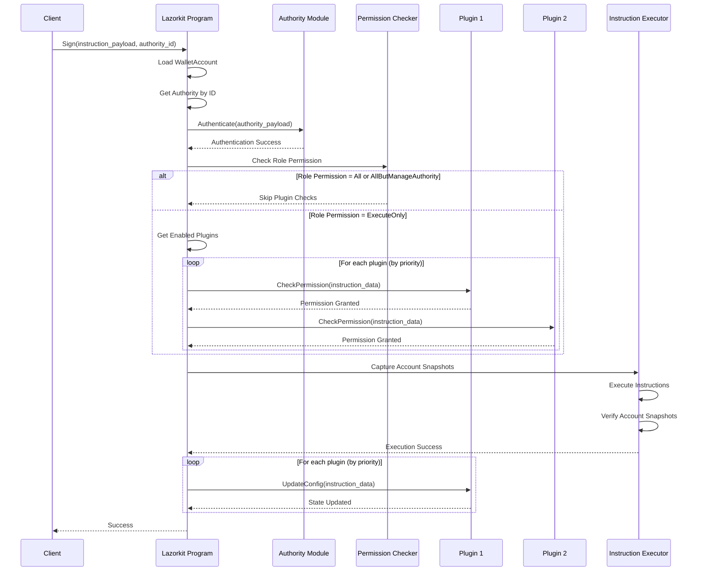
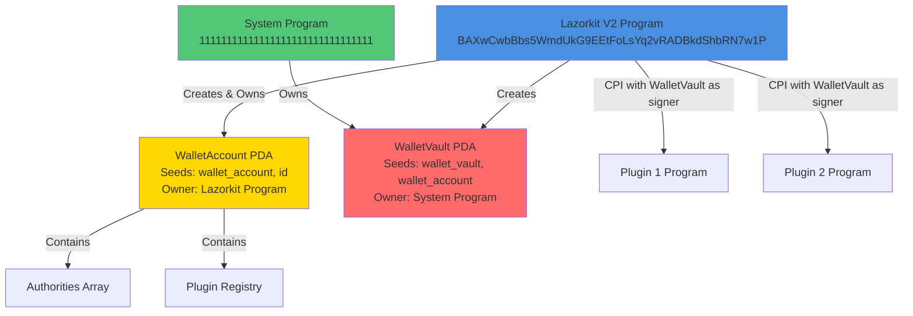
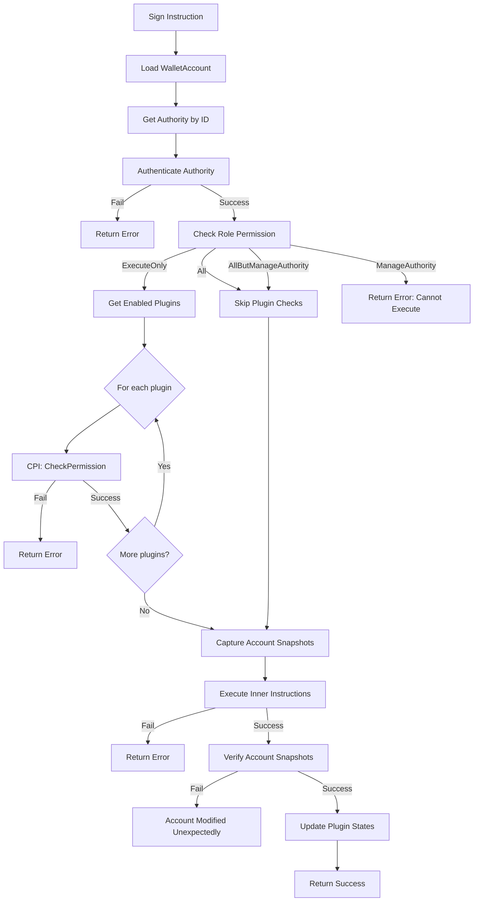

# Lazorkit V2 - Solana Smart Wallet Program

[](https://opensource.org/licenses/AGPL-3.0)

## 1. Project Overview

### TL;DR

Lazorkit V2 is a **Solana smart wallet program** that enables multi-signature wallets with flexible permission management through a hybrid architecture combining inline role permissions and external plugin-based authorization. It supports multiple authentication methods (Ed25519, Secp256k1, Secp256r1, Program Execution) and provides a plugin system for extensible permission checks.

### Purpose

Lazorkit V2 solves the problem of managing complex wallet permissions on Solana by providing:

- **Multi-signature support** with multiple authority types
- **Flexible permission system** combining fast inline checks and extensible plugins
- **Account snapshot verification** to prevent unauthorized modifications
- **Session-based authentication** for improved UX
- **Plugin architecture** for custom permission logic

### Primary Features

1. **Hybrid Permission Architecture**
   - Inline role permissions for fast, common checks
   - External plugins for advanced, custom permission logic

2. **Multiple Authority Types**
   - Ed25519 (standard and session-based)
   - Secp256k1 (standard and session-based)
   - Secp256r1 (standard and session-based, for passkeys)
   - Program Execution (standard and session-based)

3. **Account Snapshot Verification**
   - Captures account state before instruction execution
   - Verifies accounts haven't been modified unexpectedly
   - Prevents ownership changes and unauthorized data modifications

4. **Plugin System**
   - External programs can implement custom permission checks
   - Plugin priority ordering for execution sequence
   - Per-authority plugin references

5. **Role-Based Permissions**
   - `All`: Full access to all operations
   - `ManageAuthority`: Only authority management operations
   - `AllButManageAuthority`: All operations except authority management
   - `ExecuteOnly`: Only transaction execution (requires plugin checks)

## 2. Table of Contents

- [1. Project Overview](#1-project-overview)
- [2. Table of Contents](#2-table-of-contents)
- [3. System Architecture](#3-system-architecture)
- [4. PDA (Program Derived Address) Design](#4-pda-program-derived-address-design)
- [5. Instruction Reference (API)](#5-instruction-reference-api)
- [6. Account Structures](#6-account-structures)
- [7. Deployment](#7-deployment)
- [8. Usage Examples](#8-usage-examples)
- [9. Testing](#9-testing)
- [10. Notes, Caveats, Security Considerations](#10-notes-caveats-security-considerations)
- [11. License](#11-license)

## 3. System Architecture

### High-Level Overview

Lazorkit V2 follows a **Hybrid Architecture** pattern:

```
┌─────────────────────────────────────────────────────────────┐
│                    Lazorkit V2 Program                       │
│                                                               │
│  ┌─────────────────────────────────────────────────────┐    │
│  │         Instruction Processing Layer                 │    │
│  │  - CreateSmartWallet, Sign, AddAuthority, etc.      │    │
│  └─────────────────────────────────────────────────────┘    │
│                          │                                    │
│                          ▼                                    │
│  ┌─────────────────────────────────────────────────────┐    │
│  │         Authentication Layer                          │    │
│  │  - Ed25519, Secp256k1, Secp256r1, ProgramExec       │    │
│  │  - Session-based authentication                       │    │
│  └─────────────────────────────────────────────────────┘    │
│                          │                                    │
│                          ▼                                    │
│  ┌─────────────────────────────────────────────────────┐    │
│  │         Permission Check Layer (Hybrid)              │    │
│  │  ┌──────────────────┐      ┌──────────────────┐    │    │
│  │  │ Inline Role       │      │ External Plugins  │    │    │
│  │  │ Permissions       │      │ (CPI)            │    │    │
│  │  │ - All             │      │ - SolLimit        │    │    │
│  │  │ - ManageAuthority│      │ - ProgramWhitelist│    │    │
│  │  │ - AllButManage... │      │ - Custom plugins  │    │    │
│  │  │ - ExecuteOnly    │      │                   │    │    │
│  │  └──────────────────┘      └──────────────────┘    │    │
│  └─────────────────────────────────────────────────────┘    │
│                          │                                    │
│                          ▼                                    │
│  ┌─────────────────────────────────────────────────────┐    │
│  │         Execution Layer                               │    │
│  │  - Account snapshot capture                           │    │
│  │  - Instruction execution                              │    │
│  │  - Account snapshot verification                     │    │
│  └─────────────────────────────────────────────────────┘    │
└─────────────────────────────────────────────────────────────┘
```

### Key Modules

1. **`program/src/lib.rs`**: Main entry point and instruction dispatcher
2. **`program/src/actions/`**: Instruction handlers
   - `create_smart_wallet.rs`: Wallet initialization
   - `sign.rs`: Transaction execution with plugin checks
   - `add_authority.rs`, `remove_authority.rs`, `update_authority.rs`: Authority management
   - `add_plugin.rs`, `remove_plugin.rs`, `update_plugin.rs`: Plugin management
   - `create_session.rs`: Session creation
3. **`state/src/`**: State structures
   - `wallet_account.rs`: Main wallet account structure
   - `authority/`: Authority type implementations
   - `plugin.rs`: Plugin entry structure
   - `position.rs`: Authority position metadata
   - `role_permission.rs`: Inline permission types
4. **`program/src/util/`**: Utility functions
   - `plugin.rs`: Plugin CPI helpers
   - `snapshot.rs`: Account snapshot verification
   - `permission.rs`: Permission checking logic

### Data Flow

#### Sign Instruction Flow



## 4. PDA (Program Derived Address) Design

### PDA Overview

Lazorkit V2 uses two main PDAs:

1. **WalletAccount PDA**: Stores wallet state, authorities, and plugins
2. **WalletVault PDA**: System-owned PDA used as signer for CPIs

### PDA Details

#### 1. WalletAccount PDA

**Seeds:**
```rust
["wallet_account", id]
```

**Derivation:**
```rust
pub fn wallet_account_seeds(id: &[u8]) -> [&[u8]; 2] {
    [b"wallet_account", id]
}

// With bump:
pub fn wallet_account_seeds_with_bump<'a>(id: &'a [u8], bump: &'a [u8]) -> [&'a [u8]; 3] {
    [b"wallet_account", id, bump]
}
```

**Ownership:** Lazorkit V2 Program (`BAXwCwbBbs5WmdUkG9EEtFoLsYq2vRADBkdShbRN7w1P`)

**Purpose:** 
- Stores wallet configuration (discriminator, bump, id, wallet_bump, version)
- Contains dynamic data: authorities array and plugin registry
- Acts as the main wallet state account

**Storage Layout:**
```
[0..40]     WalletAccount header (40 bytes)
[40..42]    num_authorities (u16)
[42..N]     Authorities array (variable length)
            - Each authority: Position (16 bytes) + authority_data + plugin_refs
[N..N+2]    num_plugins (u16)
[N+2..M]    Plugin registry (variable length)
            - Each plugin: PluginEntry (72 bytes)
```

#### 2. WalletVault PDA

**Seeds:**
```rust
["wallet_vault", wallet_account_key]
```

**Derivation:**
```rust
pub fn wallet_vault_seeds(wallet_account_key: &[u8]) -> [&[u8]; 2] {
    [b"wallet_vault", wallet_account_key]
}

// With bump:
pub fn wallet_vault_seeds_with_bump<'a>(
    wallet_account_key: &'a [u8],
    bump: &'a [u8],
) -> [&'a [u8]; 3] {
    [b"wallet_vault", wallet_account_key, bump]
}
```

**Ownership:** System Program (`11111111111111111111111111111111`)

**Purpose:**
- Used as a signer for CPI calls to plugins
- Proves that the CPI call is authorized by the wallet
- System-owned to allow the wallet program to sign on its behalf

### PDA Relationship Diagram



## 5. Instruction Reference (API)

### Instruction Discriminators

All instructions use a 2-byte discriminator (u16) as the first bytes of instruction data:

| Instruction | Discriminator | Value |
|------------|---------------|-------|
| `CreateSmartWallet` | 0 | `0x0000` |
| `Sign` | 1 | `0x0001` |
| `AddAuthority` | 2 | `0x0002` |
| `AddPlugin` | 3 | `0x0003` |
| `RemovePlugin` | 4 | `0x0004` |
| `UpdatePlugin` | 5 | `0x0005` |
| `UpdateAuthority` | 6 | `0x0006` |
| `RemoveAuthority` | 7 | `0x0007` |
| `CreateSession` | 8 | `0x0008` |

---

### CreateSmartWallet

**Purpose:** Creates a new Lazorkit smart wallet with the first (root) authority.

**Accounts Required:**

| Index | Name | Writable | Signer | Description |
|-------|------|----------|--------|-------------|
| 0 | `wallet_account` | ✅ | ❌ | WalletAccount PDA to create |
| 1 | `wallet_vault` | ✅ | ❌ | WalletVault PDA to create (system-owned) |
| 2 | `payer` | ✅ | ✅ | Payer account for rent |
| 3 | `system_program` | ❌ | ❌ | System program account |

**Parameters:**

```rust
struct CreateSmartWalletArgs {
    id: [u8; 32],                  // Unique wallet identifier
    bump: u8,                      // PDA bump for wallet_account
    wallet_bump: u8,               // PDA bump for wallet_vault
    first_authority_type: u16,     // AuthorityType enum value
    first_authority_data_len: u16, // Length of authority data
    num_plugin_refs: u16,          // Number of plugin refs for first authority
    role_permission: u8,           // RolePermission enum (default: All = 0)
    _padding: [u8; 1],             // Padding to align to 8 bytes
}
// Followed by:
// - first_authority_data (variable length)
// - plugin_refs_data (num_plugin_refs * 8 bytes)
```

**Pre-conditions:**
- `wallet_account` must be uninitialized (empty data)
- `wallet_account` must be owned by System Program
- `wallet_vault` must be uninitialized
- PDA derivation must match provided bumps

**Post-conditions:**
- `wallet_account` is initialized with WalletAccount data
- First authority (ID = 0) is added to authorities array
- `num_authorities` = 1
- `num_plugins` = 0
- `wallet_vault` has minimum rent exemption

**Effects on State:**
- Creates and initializes `wallet_account` PDA
- Transfers lamports from `payer` to `wallet_account` for rent
- Transfers lamports from `payer` to `wallet_vault` for rent exemption

---

### Sign

**Purpose:** Executes a transaction with authentication and permission checks.

**Accounts Required:**

| Index | Name | Writable | Signer | Description |
|-------|------|----------|--------|-------------|
| 0 | `wallet_account` | ✅ | ❌ | WalletAccount PDA |
| 1 | `wallet_vault` | ❌ | ✅ | WalletVault PDA (signer for CPIs) |
| 2..N | `instruction_accounts` | Varies | Varies | Accounts for inner instructions |

**Parameters:**

```rust
struct ExecuteArgs {
    instruction_payload_len: u16, // Length of instruction payload
    authority_id: u32,            // Authority ID to authenticate
}
// Followed by:
// - instruction_payload (variable length, contains compact instructions)
// - authority_payload (variable length, authority-specific auth data)
```

**Pre-conditions:**
- `wallet_account` must be initialized
- Authority with `authority_id` must exist
- Authority authentication must succeed
- Role permission check must pass
- Plugin checks (if required) must pass

**Post-conditions:**
- All inner instructions are executed
- Account snapshots are verified (no unexpected modifications)
- Plugin states are updated (if plugins exist)

**Effects on State:**
- Executes inner instructions (may modify various accounts)
- Updates plugin config accounts (via UpdateConfig CPI)
- No direct modification to `wallet_account` (except for plugin state updates)

**Instruction Flow:**



---

### AddAuthority

**Purpose:** Adds a new authority to the wallet.

**Accounts Required:**

| Index | Name | Writable | Signer | Description |
|-------|------|----------|--------|-------------|
| 0 | `wallet_account` | ✅ | ❌ | WalletAccount PDA |
| 1 | `payer` | ✅ | ✅ | Payer account for rent |
| 2 | `system_program` | ❌ | ❌ | System program account |

**Parameters:**

```rust
struct AddAuthorityArgs {
    acting_authority_id: u32,      // Authority ID performing this action
    new_authority_type: u16,       // AuthorityType enum value
    new_authority_data_len: u16,   // Length of new authority data
    num_plugin_refs: u16,          // Number of plugin refs
    role_permission: u8,           // RolePermission enum
    _padding: [u8; 3],             // Padding
}
// Followed by:
// - acting_authority_payload (variable length, for authentication)
// - new_authority_data (variable length)
// - plugin_refs_data (num_plugin_refs * 8 bytes)
```

**Pre-conditions:**
- `acting_authority_id` must exist and authenticate successfully
- Acting authority must have `ManageAuthority` or `All` permission
- Plugin checks (if required) must pass
- New authority must not duplicate existing authority

**Post-conditions:**
- New authority is added to authorities array
- `num_authorities` is incremented
- Account is resized if necessary

**Effects on State:**
- Appends new authority to `wallet_account` authorities array
- May resize `wallet_account` if more space is needed
- Transfers lamports from `payer` for account resize

---

### RemoveAuthority

**Purpose:** Removes an authority from the wallet.

**Accounts Required:**

| Index | Name | Writable | Signer | Description |
|-------|------|----------|--------|-------------|
| 0 | `wallet_account` | ✅ | ❌ | WalletAccount PDA |
| 1 | `payer` | ✅ | ✅ | Payer account (receives refund) |
| 2 | `wallet_vault` | ❌ | ✅ | WalletVault PDA (signer) |
| 3 | `authority_to_remove` | ❌ | ❌ | Authority account (if applicable) |

**Parameters:**

```rust
struct RemoveAuthorityArgs {
    acting_authority_id: u32,      // Authority ID performing this action
    authority_id_to_remove: u32,   // Authority ID to remove
}
// Followed by:
// - acting_authority_payload (variable length, for authentication)
```

**Pre-conditions:**
- `acting_authority_id` must exist and authenticate successfully
- Acting authority must have `ManageAuthority` or `All` permission
- `authority_id_to_remove` must exist
- Cannot remove the last authority
- Plugin checks (if required) must pass

**Post-conditions:**
- Authority is removed from authorities array
- `num_authorities` is decremented
- Account may be resized (lamports refunded to `payer`)

**Effects on State:**
- Removes authority from `wallet_account` authorities array
- Compacts authorities array
- May resize `wallet_account` and refund lamports

---

### UpdateAuthority

**Purpose:** Updates an existing authority (e.g., change role permission, plugin refs).

**Accounts Required:**

| Index | Name | Writable | Signer | Description |
|-------|------|----------|--------|-------------|
| 0 | `wallet_account` | ✅ | ❌ | WalletAccount PDA |
| 1 | `wallet_vault` | ❌ | ✅ | WalletVault PDA (signer) |
| 2 | `authority_to_update` | ❌ | ❌ | Authority account (if applicable) |

**Parameters:**

```rust
struct UpdateAuthorityArgs {
    acting_authority_id: u32,      // Authority ID performing this action
    authority_id_to_update: u32,   // Authority ID to update
    // ... update fields (varies by update type)
}
// Followed by:
// - acting_authority_payload (variable length)
```

**Pre-conditions:**
- `acting_authority_id` must exist and authenticate successfully
- Acting authority must have `ManageAuthority` or `All` permission
- `authority_id_to_update` must exist
- Plugin checks (if required) must pass

**Post-conditions:**
- Authority data is updated in place
- Plugin refs may be updated

**Effects on State:**
- Modifies authority data in `wallet_account` authorities array

---

### AddPlugin

**Purpose:** Adds a plugin to the wallet's plugin registry.

**Accounts Required:**

| Index | Name | Writable | Signer | Description |
|-------|------|----------|--------|-------------|
| 0 | `wallet_account` | ✅ | ❌ | WalletAccount PDA |
| 1 | `payer` | ✅ | ✅ | Payer account for rent |
| 2 | `wallet_vault` | ❌ | ✅ | WalletVault PDA (signer) |

**Parameters:**

```rust
struct AddPluginArgs {
    acting_authority_id: u32,      // Authority ID performing this action
    program_id: [u8; 32],           // Plugin program ID
    config_account: [u8; 32],       // Plugin config PDA
    priority: u8,                   // Execution priority (0 = highest)
    enabled: u8,                    // 1 = enabled, 0 = disabled
}
// Followed by:
// - acting_authority_payload (variable length)
```

**Pre-conditions:**
- `acting_authority_id` must exist and authenticate successfully
- Acting authority must have `All` permission (only root can manage plugins)
- Plugin must not already exist in registry

**Post-conditions:**
- Plugin is added to plugin registry
- `num_plugins` is incremented
- Account may be resized

**Effects on State:**
- Appends plugin entry to `wallet_account` plugin registry
- May resize `wallet_account` if more space is needed

---

### RemovePlugin

**Purpose:** Removes a plugin from the wallet's plugin registry.

**Accounts Required:**

| Index | Name | Writable | Signer | Description |
|-------|------|----------|--------|-------------|
| 0 | `wallet_account` | ✅ | ❌ | WalletAccount PDA |
| 1 | `wallet_vault` | ❌ | ✅ | WalletVault PDA (signer) |

**Parameters:**

```rust
struct RemovePluginArgs {
    acting_authority_id: u32,      // Authority ID performing this action
    program_id: [u8; 32],           // Plugin program ID to remove
}
// Followed by:
// - acting_authority_payload (variable length)
```

**Pre-conditions:**
- `acting_authority_id` must exist and authenticate successfully
- Acting authority must have `All` permission
- Plugin must exist in registry

**Post-conditions:**
- Plugin is removed from plugin registry
- `num_plugins` is decremented
- Plugin refs in authorities are updated

**Effects on State:**
- Removes plugin entry from `wallet_account` plugin registry
- Updates plugin refs in all authorities

---

### UpdatePlugin

**Purpose:** Updates a plugin in the wallet's plugin registry (enable/disable, change priority).

**Accounts Required:**

| Index | Name | Writable | Signer | Description |
|-------|------|----------|--------|-------------|
| 0 | `wallet_account` | ✅ | ❌ | WalletAccount PDA |
| 1 | `wallet_vault` | ❌ | ✅ | WalletVault PDA (signer) |

**Parameters:**

```rust
struct UpdatePluginArgs {
    acting_authority_id: u32,      // Authority ID performing this action
    program_id: [u8; 32],           // Plugin program ID to update
    enabled: Option<u8>,           // Optional: new enabled state
    priority: Option<u8>,           // Optional: new priority
}
// Followed by:
// - acting_authority_payload (variable length)
```

**Pre-conditions:**
- `acting_authority_id` must exist and authenticate successfully
- Acting authority must have `All` permission
- Plugin must exist in registry

**Post-conditions:**
- Plugin entry is updated in place

**Effects on State:**
- Modifies plugin entry in `wallet_account` plugin registry

---

### CreateSession

**Purpose:** Creates a new authentication session for a session-based authority.

**Accounts Required:**

| Index | Name | Writable | Signer | Description |
|-------|------|----------|--------|-------------|
| 0 | `wallet_account` | ✅ | ❌ | WalletAccount PDA |
| 1 | `payer` | ✅ | ✅ | Payer account for rent |

**Parameters:**

```rust
struct CreateSessionArgs {
    authority_id: u32,              // Authority ID to create session for
    session_key: [u8; 32],          // Session key (pubkey)
    duration: u64,                  // Session duration in slots
}
// Followed by:
// - authority_payload (variable length, for authentication)
```

**Pre-conditions:**
- `authority_id` must exist
- Authority must support session-based authentication
- Authority authentication must succeed

**Post-conditions:**
- Session is created and stored in authority data
- Session expires after `duration` slots

**Effects on State:**
- Updates authority data in `wallet_account` to include session information

## 6. Account Structures

### WalletAccount

**Location:** `state/src/wallet_account.rs`

**Definition:**
```rust
#[repr(C, align(8))]
pub struct WalletAccount {
    pub discriminator: u8,      // Discriminator::WalletAccount = 1
    pub bump: u8,               // PDA bump seed
    pub id: [u8; 32],           // Unique wallet identifier
    pub wallet_bump: u8,        // WalletVault PDA bump seed
    pub version: u8,            // Account version
    pub _reserved: [u8; 4],     // Reserved padding
}
```

**Size:** 40 bytes (fixed header)

**Fields:**
- `discriminator`: Account type identifier (must be `1` for WalletAccount)
- `bump`: PDA bump seed for WalletAccount derivation
- `id`: 32-byte unique wallet identifier
- `wallet_bump`: PDA bump seed for WalletVault derivation
- `version`: Account version (currently `1`)
- `_reserved`: Reserved for future use

**Dynamic Data Layout:**
```
[0..40]     WalletAccount header
[40..42]    num_authorities: u16
[42..N]     Authorities array:
            - Position (16 bytes)
            - authority_data (variable length)
            - plugin_refs (num_plugin_refs * 8 bytes)
            - Next authority starts at boundary
[N..N+2]    num_plugins: u16
[N+2..M]    Plugin registry:
            - PluginEntry (72 bytes) * num_plugins
```

### Position

**Location:** `state/src/position.rs`

**Definition:**
```rust
#[repr(C, align(8))]
pub struct Position {
    pub authority_type: u16,        // AuthorityType enum
    pub authority_length: u16,      // Length of authority data
    pub num_plugin_refs: u16,       // Number of plugin references
    pub role_permission: u8,        // RolePermission enum
    padding: u8,                    // Padding
    pub id: u32,                    // Unique authority ID
    pub boundary: u32,              // End offset of this authority
}
```

**Size:** 16 bytes

**Fields:**
- `authority_type`: Type of authority (Ed25519, Secp256k1, etc.)
- `authority_length`: Length of the authority data in bytes
- `num_plugin_refs`: Number of plugin references for this authority
- `role_permission`: Inline role permission (All, ManageAuthority, AllButManageAuthority, ExecuteOnly)
- `id`: Unique authority identifier (0 for root authority)
- `boundary`: Byte offset marking the end of this authority's data section

### PluginEntry

**Location:** `state/src/plugin.rs`

**Definition:**
```rust
#[repr(C, align(8))]
pub struct PluginEntry {
    pub program_id: Pubkey,      // Plugin program ID (32 bytes)
    pub config_account: Pubkey,  // Plugin's config PDA (32 bytes)
    pub enabled: u8,             // 1 = enabled, 0 = disabled
    pub priority: u8,             // Execution order (0 = highest priority)
    pub _padding: [u8; 6],        // Padding to align to 8 bytes
}
```

**Size:** 72 bytes

**Fields:**
- `program_id`: The program ID of the plugin program
- `config_account`: PDA address where the plugin stores its configuration
- `enabled`: Whether the plugin is currently enabled (1) or disabled (0)
- `priority`: Execution priority (lower number = higher priority, executed first)
- `_padding`: Padding bytes for alignment

### PluginRef

**Location:** `state/src/plugin_ref.rs`

**Definition:**
```rust
#[repr(C, align(8))]
pub struct PluginRef {
    pub plugin_index: u16,       // Index into plugin registry
    pub priority: u8,             // Override priority for this authority
    pub enabled: u8,              // Override enabled state for this authority
    pub _padding: [u8; 4],        // Padding
}
```

**Size:** 8 bytes

**Fields:**
- `plugin_index`: Index of the plugin in the wallet's plugin registry
- `priority`: Priority override for this specific authority (if different from global)
- `enabled`: Enabled state override for this specific authority
- `_padding`: Padding bytes

### Authority Types

Lazorkit V2 supports multiple authority types, each with different data structures:

#### Ed25519Authority
- **Size:** Variable (typically 32 bytes for pubkey)
- **Fields:** Ed25519 public key
- **Use Case:** Standard Ed25519 signature verification

#### Secp256k1Authority
- **Size:** Variable (typically 64 bytes)
- **Fields:** Secp256k1 public key, odometer for replay protection
- **Use Case:** Ethereum-compatible signatures

#### Secp256r1Authority
- **Size:** Variable (typically 64 bytes)
- **Fields:** Secp256r1 public key, odometer for replay protection
- **Use Case:** Passkey/WebAuthn support

#### ProgramExecAuthority
- **Size:** Variable
- **Fields:** Program ID, instruction data constraints
- **Use Case:** Program-based authorization

Each authority type also has a session-based variant that includes session key and expiration information.

## 7. Deployment

### Prerequisites

1. **Rust** (latest stable version)
   ```bash
   curl --proto '=https' --tlsv1.2 -sSf https://sh.rustup.rs | sh
   ```

2. **Solana CLI** (v2.2.1 or compatible)
   ```bash
   sh -c "$(curl -sSfL https://release.solana.com/v2.2.1/install)"
   ```

3. **Anchor Framework** (optional, for Anchor-based tooling)
   ```bash
   cargo install --git https://github.com/coral-xyz/anchor avm --locked --force
   avm install latest
   avm use latest
   ```

4. **Build Tools**
   ```bash
   # Install Solana build tools
   cargo install --git https://github.com/coral-xyz/bpf-tools
   ```

### Build Process

1. **Clone the repository:**
   ```bash
   git clone <repository-url>
   cd lazorkit-v2
   ```

2. **Build the program:**
   ```bash
   # Using cargo build-sbf
   cargo build-sbf

   # Or using Anchor (if using Anchor tooling)
   anchor build
   ```

3. **Verify the build:**
   ```bash
   # Check program size
   solana program show target/deploy/lazorkit_v2.so
   ```

### Deployment to Localnet

1. **Start local validator:**
   ```bash
   solana-test-validator
   ```

2. **Set cluster to localnet:**
   ```bash
   solana config set --url localhost
   ```

3. **Deploy the program:**
   ```bash
   solana program deploy target/deploy/lazorkit_v2.so
   ```

4. **Verify deployment:**
   ```bash
   solana program show <program-id>
   ```

### Deployment to Devnet/Testnet

1. **Set cluster:**
   ```bash
   solana config set --url devnet  # or testnet
   ```

2. **Airdrop SOL (for devnet):**
   ```bash
   solana airdrop 2
   ```

3. **Deploy:**
   ```bash
   solana program deploy target/deploy/lazorkit_v2.so
   ```

### Deployment to Mainnet

⚠️ **Warning:** Mainnet deployment requires careful consideration and security audits.

1. **Set cluster:**
   ```bash
   solana config set --url mainnet-beta
   ```

2. **Verify you have sufficient SOL:**
   ```bash
   solana balance
   ```

3. **Deploy with buffer (recommended):**
   ```bash
   # Create buffer
   solana program write-buffer target/deploy/lazorkit_v2.so
   
   # Deploy from buffer
   solana program deploy --program-id <program-id> <buffer-address>
   ```

### Environment Variables

Set the following environment variables for deployment:

```bash
export ANCHOR_PROVIDER_URL=devnet  # or mainnet-beta, localhost
export ANCHOR_WALLET=~/.config/solana/id.json
export SOLANA_CLUSTER=devnet
```

## 8. Usage Examples

### Creating a Smart Wallet

#### TypeScript/JavaScript (using @solana/web3.js)

```typescript
import { 
  Connection, 
  Keypair, 
  PublicKey, 
  Transaction,
  SystemProgram 
} from '@solana/web3.js';
import { 
  createSmartWallet,
  findWalletAccount,
  findWalletVault 
} from '@lazorkit/sdk';

// Generate wallet ID
const walletId = Keypair.generate().publicKey.toBytes();

// Derive PDAs
const [walletAccount] = findWalletAccount(walletId, programId);
const [walletVault] = findWalletVault(walletAccount, programId);

// Create root authority keypair
const rootAuthority = Keypair.generate();

// Build instruction
const createWalletIx = createSmartWallet({
  walletId,
  walletAccount,
  walletVault,
  payer: payer.publicKey,
  rootAuthority: rootAuthority.publicKey,
  authorityType: AuthorityType.Ed25519,
  rolePermission: RolePermission.All,
  programId
});

// Send transaction
const tx = new Transaction().add(createWalletIx);
const signature = await connection.sendTransaction(tx, [payer, rootAuthority]);
await connection.confirmTransaction(signature);
```

#### Rust (using solana-sdk)

```rust
use solana_sdk::{
    instruction::{AccountMeta, Instruction},
    pubkey::Pubkey,
    transaction::Transaction,
};

// Generate wallet ID
let wallet_id = [0u8; 32]; // Your unique wallet ID

// Derive PDAs
let (wallet_account, wallet_account_bump) = 
    Pubkey::find_program_address(
        &[b"wallet_account", &wallet_id],
        &program_id
    );

let (wallet_vault, wallet_vault_bump) = 
    Pubkey::find_program_address(
        &[b"wallet_vault", wallet_account.as_ref()],
        &program_id
    );

// Build instruction data
let mut instruction_data = Vec::new();
instruction_data.extend_from_slice(&(0u16).to_le_bytes()); // CreateSmartWallet = 0
instruction_data.extend_from_slice(&wallet_id);
instruction_data.push(wallet_account_bump);
instruction_data.push(wallet_vault_bump);
// ... add authority data

// Create instruction
let instruction = Instruction {
    program_id,
    accounts: vec![
        AccountMeta::new(wallet_account, false),
        AccountMeta::new(wallet_vault, false),
        AccountMeta::new(payer.pubkey(), true),
        AccountMeta::new_readonly(SystemProgram::id(), false),
    ],
    data: instruction_data,
};
```

### Executing a Transaction (Sign Instruction)

```typescript
import { createSignInstruction } from '@lazorkit/sdk';

// Build inner instruction (e.g., System Transfer)
const transferIx = SystemProgram.transfer({
  fromPubkey: walletVault,
  toPubkey: recipient,
  lamports: 1000000,
});

// Create Sign instruction
const signIx = createSignInstruction({
  walletAccount,
  walletVault,
  authorityId: 0, // Root authority
  instructions: [transferIx],
  authorityPayload: signature, // Authority signature
  programId
});

// Send transaction
const tx = new Transaction().add(signIx);
const signature = await connection.sendTransaction(tx, [payer]);
```

### Adding an Authority

```typescript
import { createAddAuthorityInstruction } from '@lazorkit/sdk';

const addAuthorityIx = createAddAuthorityInstruction({
  walletAccount,
  payer: payer.publicKey,
  actingAuthorityId: 0, // Root authority performing the action
  newAuthority: {
    type: AuthorityType.Ed25519,
    pubkey: newAuthority.publicKey,
    rolePermission: RolePermission.ExecuteOnly,
  },
  programId
});

// Must be signed by root authority
const tx = new Transaction().add(addAuthorityIx);
const signature = await connection.sendTransaction(
  tx, 
  [payer, rootAuthority]
);
```

### Adding a Plugin

```typescript
import { createAddPluginInstruction } from '@lazorkit/sdk';

const pluginProgramId = new PublicKey('...'); // Plugin program ID
const [pluginConfig] = PublicKey.findProgramAddressSync(
  [payer.publicKey.toBuffer()],
  pluginProgramId
);

const addPluginIx = createAddPluginInstruction({
  walletAccount,
  walletVault,
  payer: payer.publicKey,
  pluginProgramId,
  pluginConfigAccount: pluginConfig,
  priority: 0, // Highest priority
  enabled: true,
  programId
});

const tx = new Transaction().add(addPluginIx);
const signature = await connection.sendTransaction(tx, [payer]);
```

## 9. Testing

### Test Setup

The project includes comprehensive integration tests using `solana-program-test`.

### Running Tests

1. **Run all tests:**
   ```bash
   cargo test
   ```

2. **Run specific test file:**
   ```bash
   cargo test --test account_snapshots_tests
   cargo test --test instruction_tests
   cargo test --test plugin_edge_cases_tests
   ```

3. **Run with output:**
   ```bash
   cargo test -- --nocapture
   ```

### Test Coverage

The test suite includes:

- **`account_snapshots_tests.rs`**: Account snapshot verification tests
  - Verifies account data hasn't been modified unexpectedly
  - Tests owner change detection
  - Tests exclude ranges functionality

- **`instruction_tests.rs`**: Instruction execution tests
  - CreateSmartWallet tests
  - Sign instruction tests
  - Authority management tests
  - Plugin management tests

- **`plugin_edge_cases_tests.rs`**: Plugin system edge cases
  - Multiple authorities with different plugins
  - Plugin priority ordering
  - Plugin enable/disable

- **`error_handling_tests.rs`**: Error condition tests
  - Invalid authority IDs
  - Permission denied scenarios
  - Invalid instruction data

- **`role_permission_tests.rs`**: Role permission tests
  - All permission level
  - ManageAuthority permission
  - AllButManageAuthority permission
  - ExecuteOnly permission

### Example Test Output

```bash
running 48 tests
test test_create_smart_wallet_basic ... ok
test test_sign_account_snapshots_pass ... ok
test test_sign_plugin_check_fail ... ok
test test_add_authority_basic ... ok
test test_remove_authority_basic ... ok
test test_add_plugin_basic ... ok
test test_remove_plugin_basic ... ok
...

test result: ok. 48 passed; 0 failed; 0 ignored; 0 measured; 0.56s
```

## 10. Notes, Caveats, Security Considerations

### Potential Failure Modes

1. **Account Size Limits**
   - Wallet accounts have a maximum size limit (typically 10KB on Solana)
   - Adding too many authorities or plugins may exceed this limit
   - **Mitigation:** Monitor account size and plan for account resizing if needed

2. **Plugin CPI Failures**
   - If a plugin program is unavailable or fails, the entire transaction fails
   - **Mitigation:** Use reliable plugin programs and handle errors gracefully

3. **Authority Replay Attacks**
   - Each authority type has its own odometer for replay protection
   - **Mitigation:** Always increment odometer on each signature

4. **Session Expiration**
   - Sessions expire after a fixed number of slots
   - **Mitigation:** Monitor session expiration and renew as needed

### Risks

1. **Upgrade Risk**
   - Program upgrades may break compatibility with existing wallets
   - **Mitigation:** Use immutable program deployments for production

2. **Plugin Security**
   - Malicious or buggy plugins can deny legitimate transactions
   - **Mitigation:** Only add trusted plugins, audit plugin code

3. **Authority Compromise**
   - If an authority's private key is compromised, that authority can perform authorized actions
   - **Mitigation:** Use hardware wallets, implement key rotation, use multi-sig

4. **Account Snapshot Bypass**
   - If exclude ranges are too broad, malicious modifications may go undetected
   - **Mitigation:** Carefully design exclude ranges, always include owner in hash

### Suggested Checks for Clients

1. **Pre-flight Checks**
   - Verify wallet account exists and is initialized
   - Check authority exists and has required permissions
   - Verify plugins are enabled and accessible

2. **Post-execution Verification**
   - Verify account snapshots passed
   - Check transaction succeeded
   - Verify expected state changes occurred

3. **Error Handling**
   - Handle `InvalidAuthorityNotFoundByRoleId` errors
   - Handle `PluginCheckFailed` errors
   - Handle `PermissionDenied` errors gracefully

### Gas / Compute Considerations

1. **CPI Overhead**
   - Each plugin CPI adds ~5,000 compute units
   - Multiple plugins increase transaction cost
   - **Optimization:** Use inline role permissions when possible

2. **Account Snapshot Hashing**
   - SHA256 hashing adds ~1,000 compute units per account
   - Multiple accounts increase cost
   - **Optimization:** Only snapshot writable accounts

3. **Account Size**
   - Larger accounts require more rent
   - Dynamic resizing may be expensive
   - **Optimization:** Plan account size carefully

4. **Transaction Size**
   - Large instruction payloads increase transaction size
   - May exceed transaction size limits
   - **Optimization:** Split large transactions into multiple smaller ones

### Best Practices

1. **Authority Management**
   - Use least-privilege principle (start with `ExecuteOnly`)
   - Regularly audit authority permissions
   - Implement key rotation procedures

2. **Plugin Management**
   - Only add trusted, audited plugins
   - Test plugins on devnet before mainnet
   - Monitor plugin behavior

3. **Account Management**
   - Monitor account sizes
   - Plan for account resizing if needed
   - Keep account data structures efficient

4. **Security**
   - Use hardware wallets for root authorities
   - Implement multi-sig for critical operations
   - Regular security audits

## 11. License

This project is licensed under the **GNU Affero General Public License v3.0 (AGPL-3.0)**.

See the [LICENSE](LICENSE) file for details.

### License Summary

The AGPL-3.0 license requires that:
- Any modifications to the code must be disclosed
- Any software that uses this code (even via network interaction) must also be open source under AGPL-3.0
- Commercial use is allowed but must comply with the license terms

For commercial use without AGPL requirements, contact the Lazorkit team for licensing options.

---

## Additional Resources

- **Documentation:** [https://docs.lazorkit.com](https://docs.lazorkit.com)
- **Security Policy:** [https://github.com/lazorkit/lazorkit-v2/security/policy](https://github.com/lazorkit/lazorkit-v2/security/policy)
- **Project Website:** [https://lazorkit.com](https://lazorkit.com)
- **Source Code:** [https://github.com/lazorkit/lazorkit-v2](https://github.com/lazorkit/lazorkit-v2)

## Contributing

Contributions are welcome! Please see our contributing guidelines for more information.

## Support

For support, please contact:
- **Email:** security@lazorkit.com
- **GitHub Issues:** [https://github.com/lazorkit/lazorkit-v2/issues](https://github.com/lazorkit/lazorkit-v2/issues)