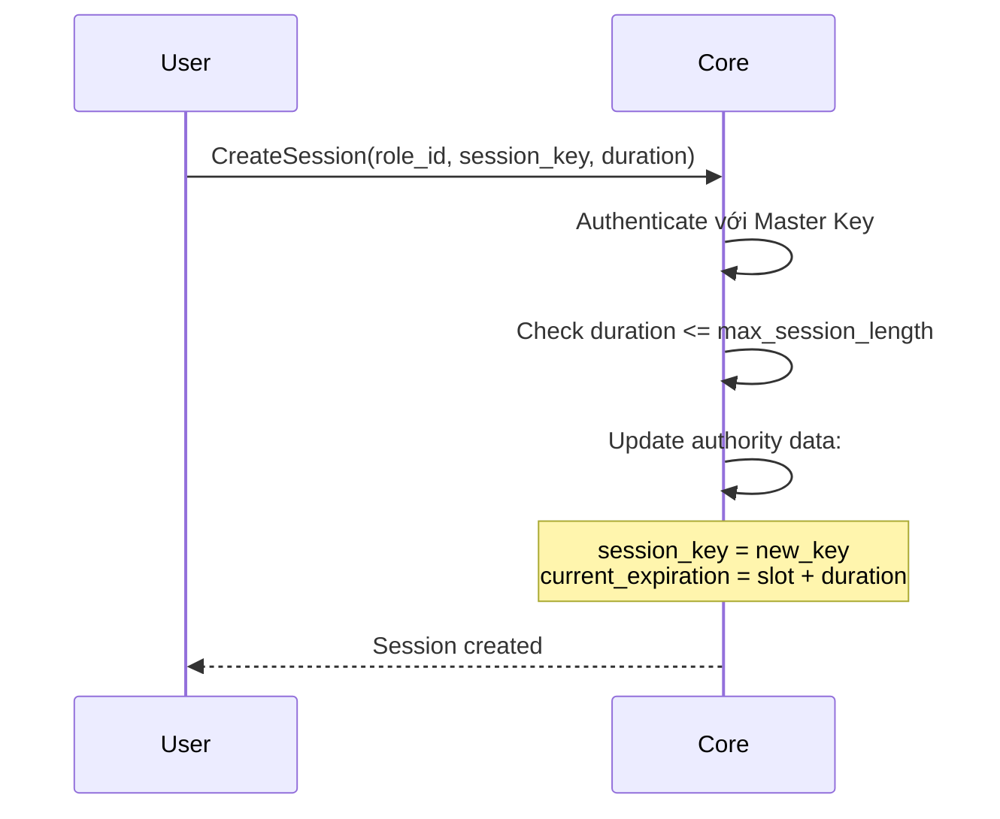
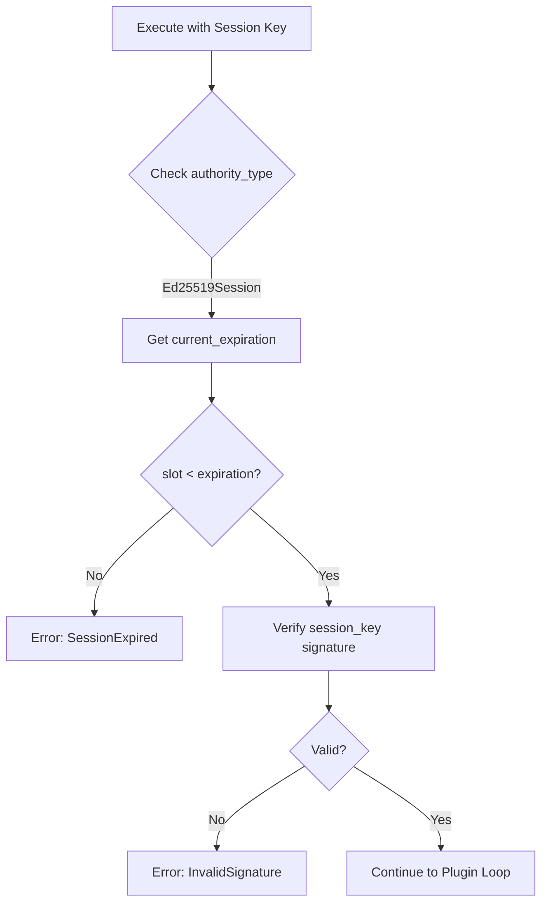
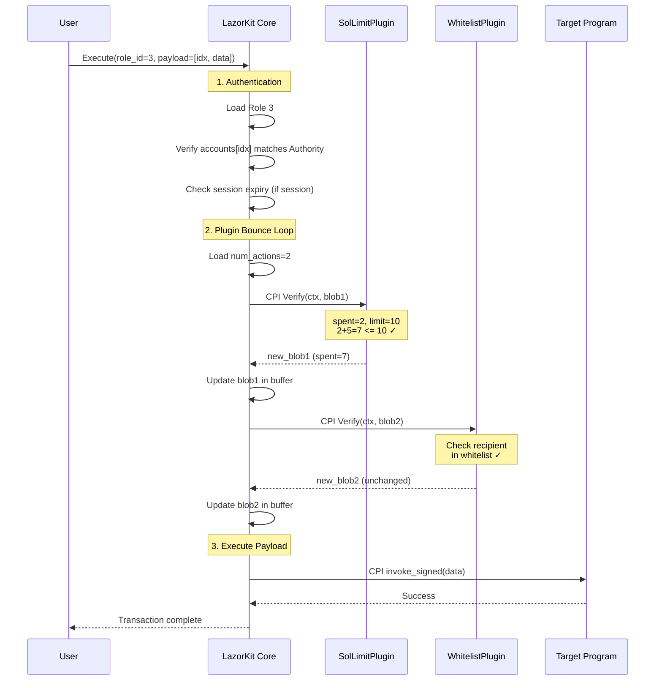

# Tài liệu Kiến trúc LazorKit (Complete)

**Phiên bản:** 2.1.0  
**Trạng thái:** Production Ready  
**Dựa trên:** Swig Wallet Protocol (99% logic core)

---

## 1. Tổng quan

LazorKit là smart contract wallet protocol trên Solana:
- **Multi-signature**: Nhiều người quản lý một ví
- **Role-Based Access Control (RBAC)**: Phân quyền chi tiết
- **Plugin-based Permissions**: Logic bảo mật mở rộng
- **Single-Account Storage**: Tiết kiệm rent

---

## 2. Authority Types (8 loại)

Hệ thống hỗ trợ đầy đủ 8 loại authority từ Swig:

### 2.1 Ed25519 (Type = 1)
- **Mô tả:** Keypair Solana tiêu chuẩn
- **Size:** 32 bytes
- **Layout:**
  ```rust
  public_key: [u8; 32]
  ```
- **Auth:** Verify signer matches public_key

### 2.2 Ed25519Session (Type = 2)
- **Mô tả:** Ed25519 với session key tạm thời
- **Size:** 80 bytes
- **Layout:**
  ```rust
  public_key: [u8; 32]           // Root key (Master)
  session_key: [u8; 32]          // Current session key
  max_session_length: u64        // Max duration (slots)
  current_session_expiration: u64 // Expiry slot
  ```
- **Auth:** 
  - Session mode: Check `slot < expiration` + verify session_key
  - Master mode: Verify public_key directly

### 2.3 Secp256k1 (Type = 3)
- **Mô tả:** Ethereum-style keypair
- **Size:** 40 bytes (Compressed pubkey + padding + odometer)
- **Layout:**
  ```rust
  public_key: [u8; 33]           // Compressed
  _padding: [u8; 3]
  signature_odometer: u32
  ```
- **Auth:** ecrecover signature verification

### 2.4 Secp256k1Session (Type = 4)
- **Mô tả:** Secp256k1 với session
- **Size:** 88 bytes
- **Layout:** Similar to Ed25519Session but with compressed pubkey

### 2.5 Secp256r1 (Type = 5)
- **Mô tả:** Hardware Enclave (Apple Secure Enclave, Android StrongBox)
- **Use case:** Passkey/WebAuthn wallets
- **Size:** 40 bytes (Compressed pubkey + padding + odometer)

### 2.6 Secp256r1Session (Type = 6)
- **Mô tả:** Secp256r1 với session
- **Size:** 88 bytes

### 2.7 ProgramExec (Type = 7)
- **Mô tả:** Cho phép program khác làm authority (CPI-based)
- **Size:** 80 bytes
- **Layout:**
  ```rust
  program_id: [u8; 32]              // Program phải gọi trước
  instruction_prefix_len: u8        // Độ dài prefix cần match
  _padding: [u8; 7]
  instruction_prefix: [u8; 40]      // Discriminator cần match
  ```
- **Auth Flow:**
  1. Kiểm tra instruction trước đó (SysvarInstructions)
  2. Verify program_id match
  3. Verify instruction data prefix match
  4. Verify accounts[0,1] là config + wallet

### 2.8 ProgramExecSession (Type = 8)
- **Mô tả:** ProgramExec với session
- **Size:** 128 bytes

---

## 3. Multi-Plugin Storage (Chi tiết)

A Role can attach **multiple plugins**. Data is stored sequentially in the buffer.

### 3.1 Cấu trúc lưu trữ

```
Role Data in Buffer:
┌────────────────────────────────────────┐
│ Position Header (16 bytes)             │
│   authority_type: u16                  │
│   authority_length: u16                │
│   num_actions: u16  ← SỐ LƯỢNG PLUGINS │
│   padding: u16                         │
│   id: u32                              │
│   boundary: u32                        │
├────────────────────────────────────────┤
│ Authority Data (variable)              │
│   (Ed25519: 32 bytes, Session: 80 bytes) │
├────────────────────────────────────────┤
│ Plugin 1:                              │
│   program_id: [u8; 32]                 │
│   data_length: u16                     │
│   boundary: u32                        │
│   state_blob: [u8; data_length]        │
├────────────────────────────────────────┤
│ Plugin 2:                              │
│   program_id: [u8; 32]                 │
│   data_length: u16                     │
│   boundary: u32                        │
│   state_blob: [u8; data_length]        │
├────────────────────────────────────────┤
│ Plugin 3...                            │
└────────────────────────────────────────┘
```

### 3.2 Plugin Header Layout (40 bytes per plugin - Aligned)

| Offset | Field | Size | Description |
|--------|-------|------|-------------|
| 0 | `program_id` | 32 | Plugin Program ID |
| 32 | `data_length` | 2 | Size of state_blob |
| 34 | `_padding` | 2 | Explicit padding for 8-byte alignment |
| 36 | `boundary` | 4 | Offset to next plugin |
| 40 | `state_blob` | var | Plugin Data (Opaque) |

### 3.3 Iterate qua plugins

```rust
fn iterate_plugins(role_data: &[u8], num_actions: u16) {
    let mut cursor = 0; // Start sau Authority Data
    
    for _ in 0..num_actions {
        let program_id = &role_data[cursor..cursor+32];
        let data_len = u16::from_le_bytes(role_data[cursor+32..cursor+34]);
        let boundary = u32::from_le_bytes(role_data[cursor+34..cursor+38]);
        let blob = &role_data[cursor+38..cursor+38+data_len];
        
        // Process plugin...
        
        cursor = boundary as usize; // Jump to next
    }
}
```

---

## 4. Session Key Mechanism

### 4.1 Tạo Session (CreateSession)



### 4.2 Sử dụng Session



### 4.3 Session Authority Sizes

| Type | Size | Fields |
|------|------|--------|
| Ed25519Session | 80 bytes | pubkey(32) + session_key(32) + max_len(8) + expiry(8) |
| Secp256k1Session | 88 bytes | pubkey(33)+pad(3)+odo(4) + session_key(32) + max_len(8) + expiry(8) |
| Secp256r1Session | 88 bytes | pubkey(33)+pad(3)+odo(4) + session_key(32) + max_len(8) + expiry(8) |
| ProgramExecSession | 128 bytes | ProgramExec(80) + session fields(48) |

---

## 5. Role Types (Recommended Hierarchy)

### 5.1 Owner (Role ID = 0) - "Super Admin"
- **Authority:** Cold Wallet (Ledger/Trezor) or Multisig.
- **Plugins:** None (Full Power).
- **Permissions:**
  - Full access to all instructions.
  - Exclusive right to `TransferOwnership` (changing Role 0).
  - Can Add/Remove/Update any role.

### 5.2 Admin (Role ID = 1) - "Manager"
- **Authority:** Hot Wallet (Laptop/Desktop).
- **Plugins:** `AuditLogPlugin` (optional).
- **Permissions:**
  - **Can:** `AddAuthority`, `RemoveAuthority`, `UpdateAuthority` for lower roles (Spender/Operator).
  - **Cannot:** Change Owner (Role 0) or delete themselves (anti-lockout).
  - **Cannot:** `Execute` funds directly (unless explicitly authorized).

### 5.3 Spender (Role ID = 2...99) - "User/Mobile"
- **Authority:** Mobile Key or Session Key.
- **Plugins:**
  - `SolLimitPlugin`: Daily spending limits.
  - `WhitelistPlugin`: Approved destination addresses.
- **Permissions:**
  - `Execute`: Subject to plugin validation.
  - `CreateSession`: Can create session keys for themselves.

### 5.4 Operator (Role ID >= 100) - "Automation/Bot"
- **Authority:** `Ed25519Session` or `ProgramExecSession` (Hot Wallet on Server).
- **Plugins:**
  - `ProgramWhitelist`: Restricted to specific DeFi protocols.
- **Permissions:**
  - `Execute`: Strictly limited automated tasks.

---
## 6. Plugin Registry System ("App Store" for Plugins)

LazorKit enforces security by requiring plugins to be verified before they can be added to a wallet. This prevents users from accidentally installing malicious or unverified code.

### 6.1 Registry Entry PDA
Each verified plugin has a corresponding `PluginRegistryEntry` PDA controlled by the LazorKit Protocol (Factory).

- **Seeds**: `["plugin-registry", plugin_program_id]`
- **Authority**: Protocol Admin / DAO.

### 6.2 Data Structure
```rust
struct PluginRegistryEntry {
    pub program_id: Pubkey,    // 32
    pub is_active: bool,       // 1 (Can be deactivated to ban malicious plugins)
    pub added_at: i64,         // 8
    pub bump: u8,              // 1
}
```

### 6.3 Enforcement Flow
When `AddAuthority` or `UpdateAuthority` is called to add a plugin:
1.  Contract derives the `PluginRegistryEntry` PDA for that plugin's Program ID.
2.  Checks if the account exists and `is_active == true`.
3.  If valid -> Allow addition.
4.  If invalid -> Revert with `UnverifiedPlugin`.

*(Future: Wallets can have a `developer_mode` flag to bypass this for testing purposes, but default is Secure).*

## 6. Instruction Set

### 6.1 CreateWallet
- **Discriminator:** 0
- **Accounts:** Config(W), Payer(W,S), WalletAddress(W), System
- **Args:** `{id: [u8;32], bump: u8, wallet_bump: u8, owner_auth: [u8], owner_type: u16}`

### 6.2 AddAuthority
- **Discriminator:** 1
- **Accounts:** Config(W,S), Payer(W,S), System
- **Args:** `{auth_type: u16, auth_data: [u8], plugins_config: [u8]}`

### 6.3 RemoveAuthority
- **Discriminator:** 2
- **Accounts:** Config(W,S), Payer(W,S), System
- **Args:** `{role_id: u32}`

### 6.4 UpdateAuthority
- **Discriminator:** 3
- **Accounts:** Config(W,S), Payer(W,S), System
- **Args:** `{target_role_id: u32, operation: u8, payload: [u8]}`
- **Operations:** 0=ReplaceAll, 1=AddPlugins, 2=RemoveByType, 3=RemoveByIndex

### 6.5 CreateSession
- **Discriminator:** 4
- **Accounts:** Config(W,S), Payer(W,S), System
- **Args:** `{role_id: u32, session_key: [u8;32], duration: u64}`

### 6.6 Execute
- **Discriminator:** 5
- **Accounts:** Config(W), WalletAddress(W,S), System, TargetProgram, ...TargetAccounts
- **Args:** `{role_id: u32, instruction_payload: [u8]}`
- **Payload Format:**
  ```
  [0]: signer_index (u8) - Index of the signer account in the transaction
  [1..]: target_instruction_data (Variable)
  ```

### 6.7 TransferOwnership
- **Discriminator:** 6
- **Accounts:** Config(W,S), Payer(S)
- **Args:** `{new_owner_auth: [u8], new_owner_type: u16}`

---

## 7. Execute Flow (Bounce Pattern)



---

## 8. Plugin Interface

### Input (CPI Data)
```rust
[0]: Discriminator = 0 (Verify)
[1..]: VerificationContext (Borsh)
       wallet_pubkey: Pubkey
       authority_pubkey: Pubkey
       role_id: u32
       slot: u64
       instruction_data: Vec<u8>
[...]: current_state_blob
```

### Output
```rust
sol_set_return_data(&new_state_blob);
```

### Error Handling
- Plugin returns `Err(...)` → Whole transaction reverts
- Plugin returns `Ok(())` + return_data → Continue to next plugin
