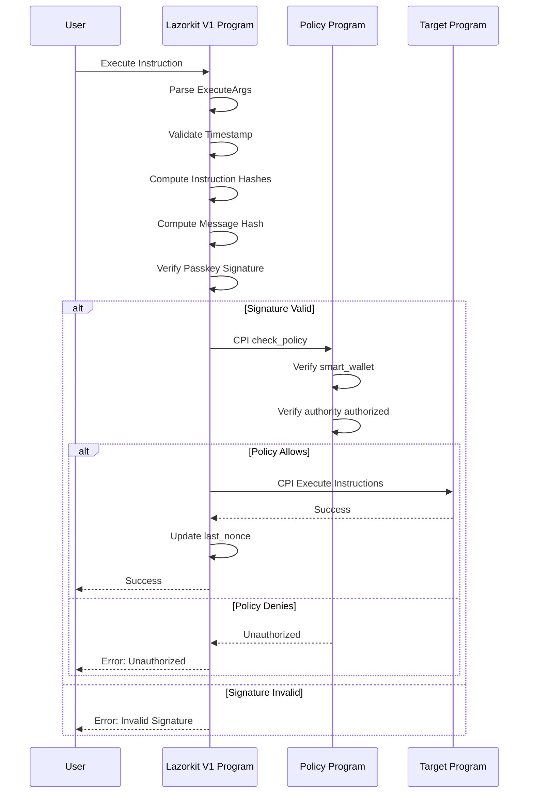
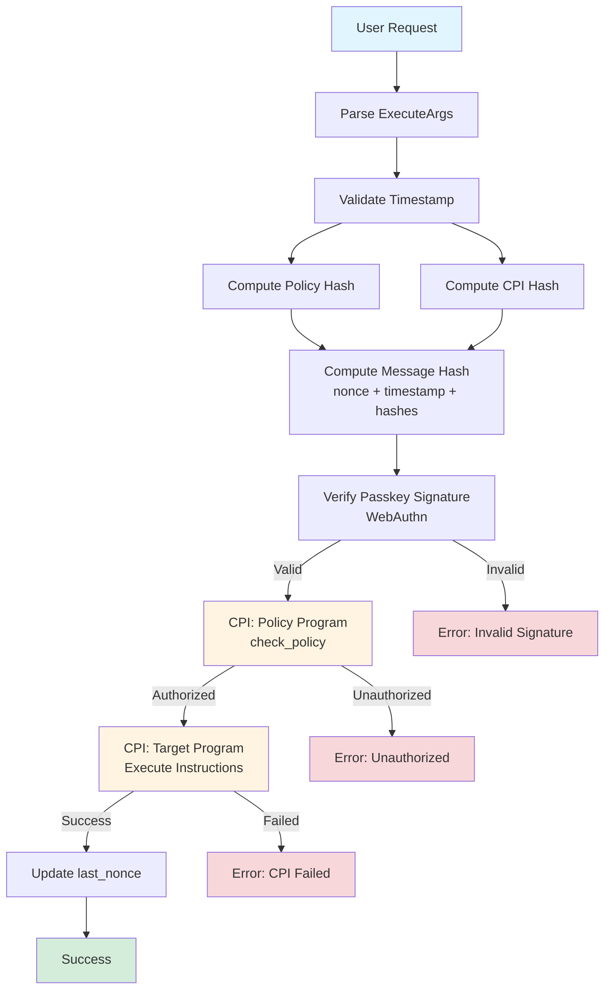
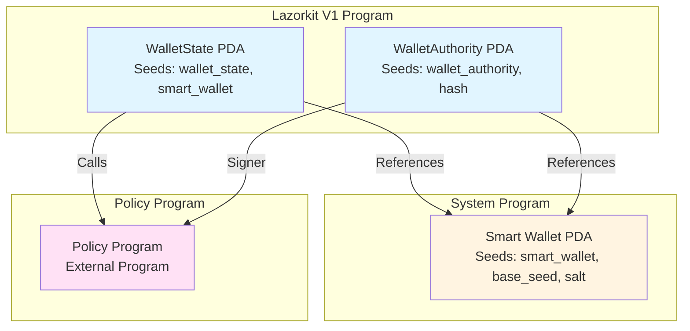

# Lazorkit V1 Architecture

## Overview

Lazorkit V1 is a smart wallet using the Anchor framework with WebAuthn Passkey authentication. The system uses a separate Policy Program to check permissions.

---

## 1. PDA Structure (Program Derived Addresses)

### 1.1. WalletState PDA

**Seeds:**
```rust
seeds = [
    b"wallet_state",
    smart_wallet.key().as_ref()
]
```

**Structure:**
```rust
pub struct WalletState {
    pub bump: u8,                    // PDA bump seed
    pub last_nonce: u64,             // Anti-replay protection
    pub base_seed: [u8; 32],         // Initial credential_hash
    pub salt: u64,                   // Salt for wallet derivation
    pub policy_program: Pubkey,      // Policy program ID
    pub policy_data: Vec<u8>,        // Serialized policy data
}
```

**PDA Derivation:**
- `WalletState` is derived from `smart_wallet` address
- Each `smart_wallet` has one corresponding `WalletState`

### 1.2. Smart Wallet PDA

**Seeds:**
```rust
seeds = [
    SMART_WALLET_SEED,              // b"smart_wallet"
    wallet_state.base_seed,          // credential_hash
    wallet_state.salt.to_le_bytes()  // salt
]
```

**Structure:**
- System-owned PDA account
- Used as signer for CPI calls
- Bump seed is stored in `WalletState.bump`

### 1.3. WalletAuthority PDA

**Seeds:**
```rust
seeds = [
    b"wallet_authority",
    create_wallet_authority_hash(smart_wallet.key(), credential_hash)
]
```

**Structure:**
```rust
pub struct WalletAuthority {
    pub passkey_pubkey: [u8; 33],    // Secp256r1 compressed public key
    pub credential_hash: [u8; 32],   // SHA256 hash of credential ID
    pub smart_wallet: Pubkey,        // Associated smart wallet
    pub bump: u8,                    // PDA bump seed
}
```

**PDA Derivation:**
- Each passkey credential has one `WalletAuthority` account
- Hash is created from `smart_wallet` + `credential_hash`

---

## 2. Permission Rules

### 2.1. Policy Program Architecture

**Architecture:**
- **Separate Policy Program**: Permissions are managed by a separate program (`policy_program`)
- **Policy Data**: Serialized policy data is stored in `WalletState.policy_data`
- **Policy Check**: Each transaction must call `check_policy` instruction from policy program

### 2.2. Policy Check Flow

**CheckPolicy Instruction:**
```rust
pub fn check_policy(ctx: Context<CheckPolicy>, policy_data: Vec<u8>) -> Result<()> {
    let policy_struct = PolicyStruct::try_from_slice(&policy_data)?;
    
    // Verify smart_wallet matches
    require!(
        policy_struct.smart_wallet == ctx.accounts.smart_wallet.key(),
        PolicyError::InvalidSmartWallet
    );
    
    // Verify authority is authorized
    require!(
        policy_struct.authoritis.contains(&ctx.accounts.authority.key()),
        PolicyError::Unauthorized
    );
    
    Ok(())
}
```

**Policy Accounts:**
- `authority`: `WalletAuthority` account (signer, owner = Lazorkit program)
- `smart_wallet`: System account

### 2.3. Permission Types

**Default Policy:**
- Policy program checks if `WalletAuthority` is in the list of authorized authorities
- Policy data contains the list of authorized authorities

---

## 3. Execute Flow

### 3.1. Execute Instruction Flow



### 3.2. Execute Instruction Flow (Detailed)

**Step 1: Parse Arguments**
```rust
pub struct ExecuteArgs {
    pub passkey_public_key: [u8; 33],
    pub signature: [u8; 64],
    pub client_data_json_raw: Vec<u8>,
    pub authenticator_data_raw: Vec<u8>,
    pub verify_instruction_index: u8,
    pub split_index: u16,
    pub policy_data: Vec<u8>,        // Policy instruction data
    pub cpi_data: Vec<u8>,           // CPI instruction data
    pub timestamp: i64,
}
```

**Step 2: Validate Timestamp**
```rust
validation::validate_instruction_timestamp(args.timestamp)?;
```

**Step 3: Compute Instruction Hashes**
```rust
let policy_hash = compute_instruction_hash(
    &args.policy_data, 
    policy_accounts, 
    policy_program_key
)?;

let cpi_hash = compute_instruction_hash(
    &args.cpi_data, 
    cpi_accounts, 
    cpi_program_key
)?;
```

**Step 4: Compute Expected Message Hash**
```rust
let expected_message_hash = compute_execute_message_hash(
    last_nonce, 
    args.timestamp, 
    policy_hash, 
    cpi_hash
)?;
```

**Step 5: Verify Passkey Signature**
```rust
verify_authorization_hash(
    &ctx.accounts.ix_sysvar,
    args.passkey_public_key,
    args.signature,
    &args.client_data_json_raw,
    &args.authenticator_data_raw,
    args.verify_instruction_index,
    expected_message_hash,
)?;
```

**Step 6: Execute Policy Check (CPI)**
```rust
// Verify policy instruction discriminator
require!(
    policy_data.get(0..8) == Some(&sighash("global", "check_policy")),
    LazorKitError::InvalidInstructionDiscriminator
);

// CPI to policy program
execute_cpi(
    policy_accounts,
    policy_data,
    &ctx.accounts.policy_program,
    &wallet_authority,
)?;
```

**Step 7: Execute CPI Instructions**
```rust
let wallet_signer = PdaSigner {
    seeds: vec![
        SMART_WALLET_SEED.to_vec(),
        ctx.accounts.wallet_state.base_seed.to_vec(),
        ctx.accounts.wallet_state.salt.to_le_bytes().to_vec(),
    ],
    bump: wallet_bump,
};

execute_cpi(
    cpi_accounts,
    &args.cpi_data,
    &ctx.accounts.cpi_program,
    &wallet_signer,
)?;
```

**Step 8: Update Nonce**
```rust
ctx.accounts.wallet_state.last_nonce = validation::safe_increment_nonce(last_nonce);
```

### 3.2. Execute Flow Diagram



### 3.3. Detailed Execute Flow

```
1. User Request
   ↓
2. Parse ExecuteArgs
   ↓
3. Validate Timestamp
   ↓
4. Compute Instruction Hashes (policy + cpi)
   ↓
5. Compute Expected Message Hash (nonce + timestamp + hashes)
   ↓
6. Verify Passkey Signature (WebAuthn)
   ↓
7. CPI to Policy Program (check_policy)
   ├─ Verify smart_wallet matches
   └─ Verify authority is authorized
   ↓
8. CPI to Target Program (execute instructions)
   └─ Smart wallet signs as PDA
   ↓
9. Update last_nonce
   ↓
10. Success
```

### 3.3. Security Features

**Anti-Replay Protection:**
- `last_nonce`: Each transaction increments nonce, preventing replay attacks
- `timestamp`: Validate timestamp to prevent stale transactions

**Message Hash:**
- Hash includes: `nonce + timestamp + policy_hash + cpi_hash`
- Ensures integrity of entire transaction

**Passkey Authentication:**
- WebAuthn signature verification
- Client data and authenticator data validation

---

## 4. Account Relationships

### 4.1. PDA Relationship Diagram



### 4.2. Account Structure

```
WalletState (PDA)
├─ Owned by: Lazorkit Program
├─ Seeds: [b"wallet_state", smart_wallet.key()]
└─ Contains: policy_program, policy_data, last_nonce

Smart Wallet (PDA)
├─ Owned by: System Program
├─ Seeds: [SMART_WALLET_SEED, base_seed, salt]
└─ Used as: Signer for CPI calls

WalletAuthority (PDA)
├─ Owned by: Lazorkit Program
├─ Seeds: [b"wallet_authority", hash(smart_wallet, credential_hash)]
└─ Contains: passkey_pubkey, credential_hash, smart_wallet

Policy Program
└─ External program that validates permissions
```

---

## 5. Key Differences from Swig/Lazorkit V2

1. **Separate Policy Program**: Permissions are managed by external program, not inline in wallet state
2. **WebAuthn Only**: Only supports Passkey authentication (Secp256r1)
3. **Anchor Framework**: Uses Anchor instead of Pinocchio
4. **No Inline Actions**: No inline action system, all logic in policy program
5. **Message Hash Verification**: Uses hash-based message verification instead of direct signature check
