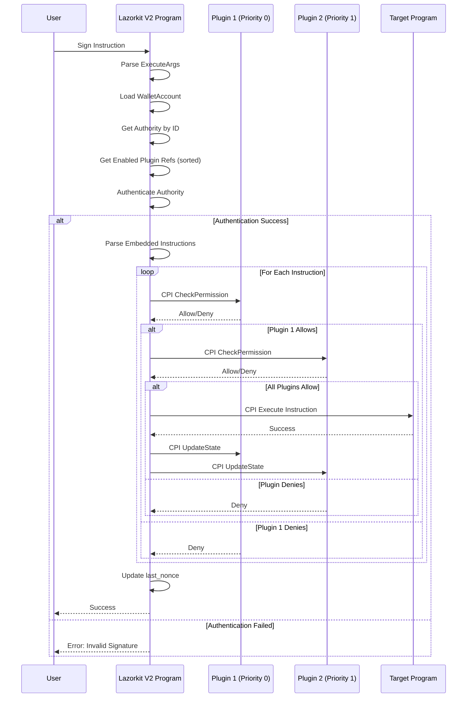
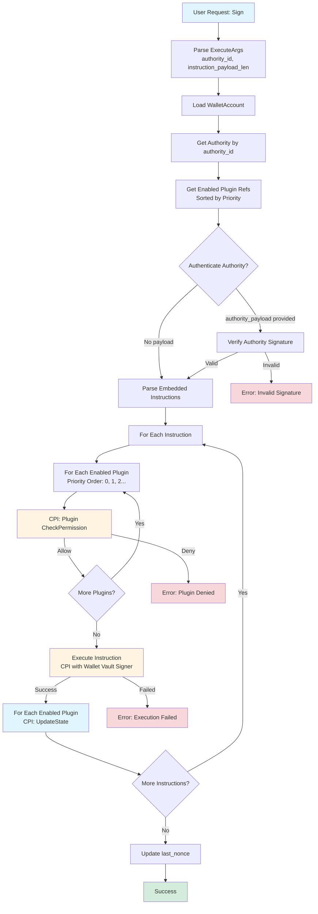
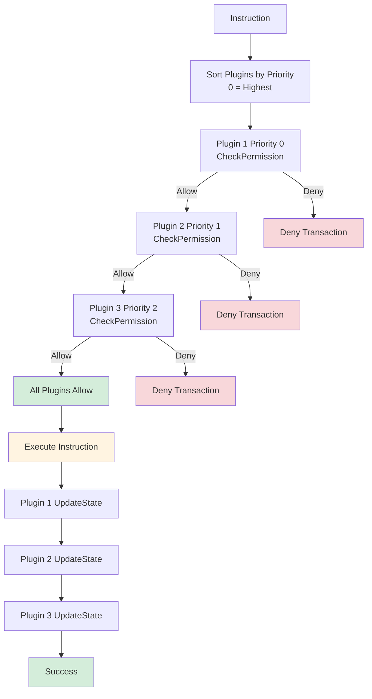
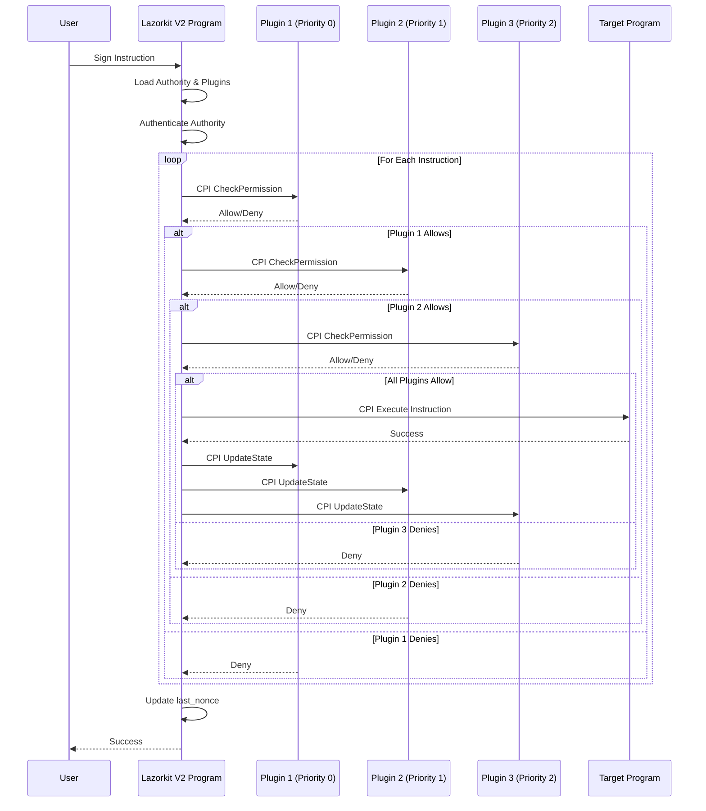
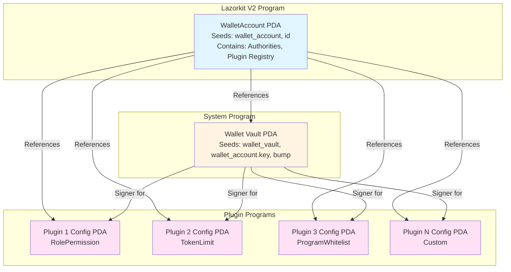
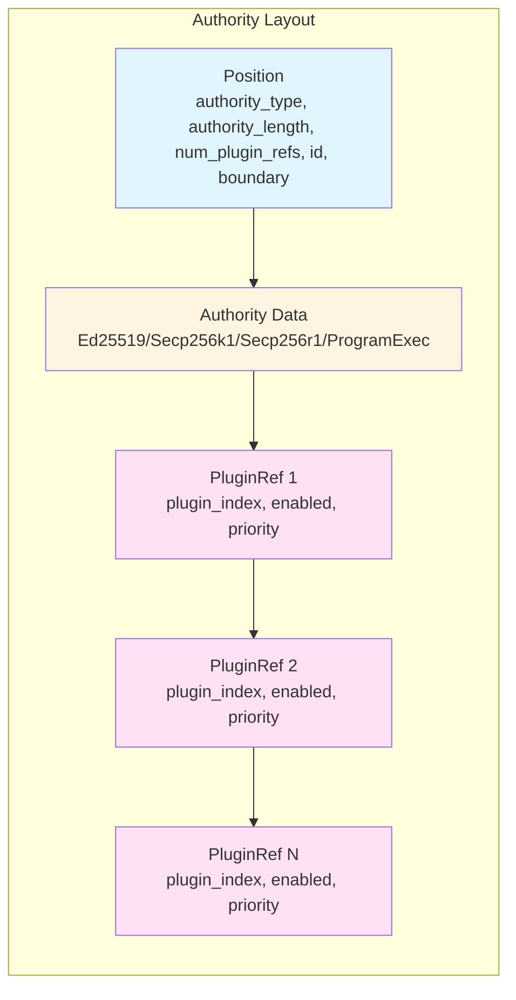

# Lazorkit V2 Architecture

## Overview

Lazorkit V2 is a smart wallet using the Pinocchio framework with a "Pure External" plugin architecture. All permissions and complex logic are handled by external plugin programs, making the main contract a minimal "dump wallet" that only stores data and routes CPI calls.

---

## 1. PDA Structure (Program Derived Addresses)

### 1.1. WalletAccount PDA

**Seeds:**
```rust
seeds = [
    b"wallet_account",
    id.as_ref()  // 32-byte wallet ID
]
```

**Structure:**
```rust
pub struct WalletAccount {
    pub discriminator: u8,      // Account type discriminator
    pub bump: u8,               // PDA bump seed
    pub id: [u8; 32],           // Unique wallet identifier
    pub wallet_bump: u8,        // Wallet vault PDA bump seed
    pub version: u8,            // Account version
    pub _reserved: [u8; 4],     // Reserved padding (40 bytes total)
    
    // Dynamic data follows (inline):
    // - num_authorities: u16 (2 bytes)
    // - Authorities (Position + Authority data + PluginRefs)
    // - num_plugins: u16 (2 bytes)
    // - Plugin Registry (PluginEntry[])
    // - last_nonce: u64 (8 bytes)
}
```

**PDA Derivation:**
- Each wallet has one `WalletAccount` PDA
- All authorities and plugin registry are stored inline in this account
- Similar to Swig's single account design for cost efficiency

### 1.2. Wallet Vault PDA

**Seeds:**
```rust
seeds = [
    b"wallet_vault",
    wallet_account.key().as_ref(),  // WalletAccount pubkey (not id)
    wallet_bump.as_ref()
]
```

**Structure:**
- System-owned PDA account
- Used as signer for CPI calls
- Equivalent to "swig-wallet-address" in Swig

### 1.3. Plugin Config PDAs

**Seeds (per plugin):**
```rust
seeds = [
    plugin_specific_seed,        // e.g., b"role_permission_config"
    wallet_account.key().as_ref(),
    bump.as_ref()
]
```

**Structure:**
- Each plugin has its own config PDA
- Owned by the plugin program
- Stores plugin-specific configuration

---

## 2. Permission Rules (External Plugins)

### 2.1. Plugin Architecture

**Pure External Design:**
- **No Inline Permissions**: All permission logic is in external plugin programs
- **Plugin Registry**: List of plugins stored in `WalletAccount`
- **Plugin References**: Each authority can reference multiple plugins
- **Plugin Priority**: Plugins are called in priority order (0 = highest)

**Plugin Entry:**
```rust
pub struct PluginEntry {
    pub program_id: Pubkey,      // Plugin program ID
    pub config_account: Pubkey,  // Plugin config PDA
    pub plugin_type: u8,          // PluginType enum
    pub enabled: u8,              // 0 = disabled, 1 = enabled
    pub priority: u8,             // Priority (0 = highest)
    pub _padding: [u8; 5],       // Padding
}
```

**Plugin Reference:**
```rust
pub struct PluginRef {
    pub plugin_index: u16,        // Index in plugin registry
    pub enabled: u8,              // 0 = disabled, 1 = enabled
    pub priority: u8,             // Priority (0 = highest)
    pub _padding: [u8; 4],       // Padding
}
```

### 2.2. Plugin Types

**Available Plugin Types:**
- `RolePermission`: Role-based permissions (All, ManageAuthority, AllButManageAuthority)
- `TokenLimit`: Token transfer limits
- `ProgramWhitelist`: Program whitelisting
- Custom plugins can be added without contract updates

### 2.3. Plugin Instructions

**CheckPermission (0):**
- Called before instruction execution
- Must return `Ok(())` to allow, `Err()` to deny
- Receives: authority_id, authority_data, instruction_data

**UpdateState (1):**
- Called after successful instruction execution
- Used to update plugin state (e.g., decrement limits)
- Receives: instruction_data

**ValidateAddAuthority (2):**
- Called when adding a new authority
- Can validate authority data before adding
- Optional: Some plugins may not implement this

**Initialize (3):**
- Called when initializing plugin config
- Creates and initializes plugin config PDA

### 2.4. Permission Check Flow

**Plugin CPI Format:**
```rust
// CheckPermission instruction data
[0] - PluginInstruction::CheckPermission (u8)
[1-4] - authority_id (u32, little-endian)
[5-8] - authority_data_len (u32, little-endian)
[9..9+authority_data_len] - authority_data
[9+authority_data_len..9+authority_data_len+4] - instruction_data_len (u32, little-endian)
[9+authority_data_len+4..] - instruction_data

// CPI Accounts
[0] - Plugin Config PDA (writable)
[1] - Wallet Account (read-only)
[2] - Wallet Vault (signer)
[3..] - Instruction accounts
```

**Plugin Check Logic:**
- Plugins are called in priority order (0 = highest)
- All enabled plugins must allow for execution to proceed
- If any plugin denies → transaction fails

---

## 3. Execute Flow (Sign Instruction)

### 3.1. Sign Instruction Flow



### 3.2. Sign Instruction Flow (Detailed)

**Step 1: Parse Arguments**
```rust
pub struct ExecuteArgs {
    pub instruction: u16,              // LazorkitInstruction::Sign = 1
    pub instruction_payload_len: u16,
    pub authority_id: u32,             // Authority ID in wallet account
}
```

**Step 2: Load WalletAccount**
```rust
let wallet_account = WalletAccount::load_unchecked(
    &wallet_account_data[..WalletAccount::LEN]
)?;
```

**Step 3: Get Authority by ID**
```rust
let authority_data = wallet_account
    .get_authority(wallet_account_data, args.authority_id)?
    .ok_or(LazorkitError::InvalidAuthorityNotFoundByRoleId)?;
```

**Step 4: Get Enabled Plugin Refs**
```rust
let all_plugins = wallet_account.get_plugins(wallet_account_data)?;

let mut enabled_refs: Vec<&PluginRef> = authority_data
    .plugin_refs
    .iter()
    .filter(|r| r.is_enabled())
    .collect();

enabled_refs.sort_by_key(|r| r.priority);  // Sort by priority (0 = highest)
```

**Step 5: Authenticate Authority (Optional)**
```rust
// If authority_payload is provided, authenticate
if !authority_payload.is_empty() {
    authenticate_authority(
        &authority_data,
        authority_payload,
        accounts,
    )?;
}
```

**Step 6: Parse Embedded Instructions**
```rust
let wallet_vault_seeds: [Seed; 3] = [
    Seed::from(WalletAccount::WALLET_VAULT_SEED),
    Seed::from(wallet_account_info.key().as_ref()),
    Seed::from(wallet_bump.as_ref()),
];

let ix_iter = InstructionIterator::new(
    accounts,
    instruction_payload,
    wallet_vault_info.key(),
    rkeys,
)?;
```

**Step 7: For Each Instruction - Check Plugin Permissions**
```rust
for instruction in ix_iter {
    // CPI to each enabled plugin (in priority order)
    for plugin_ref in &enabled_refs {
        let plugin = &all_plugins[plugin_ref.plugin_index as usize];
        
        check_plugin_permission(
            plugin,
            &instruction,
            accounts,
            wallet_account_info,
            wallet_vault_info,
            &authority_data,
            &wallet_vault_seeds[..],
        )?;
    }
    
    // If all plugins allow, proceed to execution
}
```

**Step 8: Execute Instruction**
```rust
// Execute instruction using invoke_signed_dynamic
invoke_signed_dynamic(
    &instruction_struct,
    instruction_account_infos.as_slice(),
    &[wallet_vault_seeds_slice],
)?;
```

**Step 9: Update Plugin States**
```rust
// CPI to each enabled plugin to update state
for plugin_ref in &enabled_refs {
    let plugin = &all_plugins[plugin_ref.plugin_index as usize];
    
    update_plugin_state(
        plugin,
        &instruction,
        accounts,
        wallet_account_info,
        wallet_vault_info,
        &wallet_vault_seeds[..],
    )?;
}
```

**Step 10: Update Nonce**
```rust
let current_nonce = wallet_account.get_last_nonce(wallet_account_mut)?;
wallet_account.set_last_nonce(wallet_account_mut, current_nonce.wrapping_add(1))?;
```

### 3.2. Execute Flow Diagram



### 3.3. Plugin Check Flow Detail



### 3.4. Detailed Execute Flow

```
1. User Request (Sign instruction)
   ↓
2. Parse ExecuteArgs (authority_id, instruction_payload_len)
   ↓
3. Load WalletAccount
   ↓
4. Get Authority by authority_id
   ↓
5. Get Enabled Plugin Refs (sorted by priority)
   ↓
6. Authenticate Authority (if authority_payload provided)
   ↓
7. Parse Embedded Instructions
   ↓
8. For Each Instruction:
   ├─ For Each Enabled Plugin (priority order):
   │  ├─ CPI CheckPermission
   │  ├─ Plugin validates instruction
   │  └─ If deny → Transaction fails
   ├─ If all plugins allow:
   │  ├─ Execute instruction (CPI with wallet vault signer)
   │  └─ For Each Enabled Plugin:
   │     └─ CPI UpdateState (update plugin state)
   └─ Continue to next instruction
   ↓
9. Update last_nonce
   ↓
10. Success
```

### 3.3. Plugin Check Priority

**Priority System:**
- Plugins are sorted by `priority` field (0 = highest priority)
- Higher priority plugins are checked first
- All enabled plugins must allow for execution

**Example:**
```
Plugin A: priority = 0 (checked first)
Plugin B: priority = 1 (checked second)
Plugin C: priority = 2 (checked third)

If Plugin A denies → Transaction fails immediately
If Plugin A allows, Plugin B denies → Transaction fails
If all allow → Execute instruction, then update all plugin states
```

### 3.4. Plugin CPI Flow Diagram



---

## 4. Account Relationships

### 4.1. PDA Relationship Diagram



### 4.2. WalletAccount Internal Structure

```mermaid
graph TB
    subgraph "WalletAccount (Dynamic Size)"
        Header[Header<br/>40 bytes<br/>discriminator, bump, id, wallet_bump, version]
        Meta1[num_authorities: u16]
        Auth1[Authority 1<br/>Position + Authority Data + PluginRefs]
        Auth2[Authority 2<br/>Position + Authority Data + PluginRefs]
        AuthN[Authority N<br/>Position + Authority Data + PluginRefs]
        Meta2[num_plugins: u16]
        Plugin1[Plugin Entry 1]
        Plugin2[Plugin Entry 2]
        PluginN[Plugin Entry N]
        Nonce[last_nonce: u64]
    end
    
    Header --> Meta1
    Meta1 --> Auth1
    Auth1 --> Auth2
    Auth2 --> AuthN
    AuthN --> Meta2
    Meta2 --> Plugin1
    Plugin1 --> Plugin2
    Plugin2 --> PluginN
    PluginN --> Nonce
    
    style Header fill:#e1f5ff
    style Meta1 fill:#fff4e1
    style Auth1 fill:#ffe1f5
    style Auth2 fill:#ffe1f5
    style AuthN fill:#ffe1f5
    style Meta2 fill:#fff4e1
    style Plugin1 fill:#e1f5ff
    style Plugin2 fill:#e1f5ff
    style PluginN fill:#e1f5ff
    style Nonce fill:#fff4e1
```



### 4.3. Authority Structure with Plugin Refs



### 4.4. Account Structure

```
WalletAccount (PDA)
├─ Owned by: Lazorkit V2 Program
├─ Seeds: [b"wallet_account", id]
├─ Contains: Authorities, Plugin Registry (inline)
└─ Size: Dynamic (grows with authorities/plugins)

Wallet Vault (PDA)
├─ Owned by: System Program
├─ Seeds: [b"wallet_vault", wallet_account.key(), wallet_bump]
└─ Used as: Signer for CPI calls

Plugin Config PDAs
├─ Owned by: Plugin Programs
├─ Seeds: [plugin_seed, wallet_account.key(), bump]
└─ Contains: Plugin-specific configuration
```

---

## 5. Key Features

1. **Pure External Plugins**: All permission logic in external programs
2. **No Contract Updates**: Add new plugins without upgrading main contract
3. **Single Account Design**: All data in one account → reduces rent cost
4. **Plugin Priority**: Plugins called in priority order
5. **Flexible Plugin System**: Each authority can reference multiple plugins
6. **Plugin State Updates**: Plugins can update state after execution
7. **Multiple Authority Types**: Supports Ed25519, Secp256k1, Secp256r1, ProgramExec
8. **Session Support**: Session-based authorities with expiration

---

## 6. Plugin Examples

### 6.1. RolePermission Plugin
```rust
// Permission types
- All: Allow all operations
- ManageAuthority: Only allow authority management
- AllButManageAuthority: Allow all except authority management

// CheckPermission logic
if instruction is authority management (AddAuthority, RemoveAuthority, etc.) {
    if permission_type == ManageAuthority → Allow
    if permission_type == AllButManageAuthority → Deny
} else {
    if permission_type == AllButManageAuthority → Allow
    if permission_type == ManageAuthority → Deny
}
```

### 6.2. TokenLimit Plugin
```rust
// Config
pub struct TokenLimitConfig {
    pub mint: Pubkey,
    pub remaining_amount: u64,
}

// CheckPermission logic
if instruction is token transfer {
    if transfer_amount > remaining_amount → Deny
    else → Allow
}

// UpdateState logic
remaining_amount -= transfer_amount
```

### 6.3. ProgramWhitelist Plugin
```rust
// Config
pub struct ProgramWhitelistConfig {
    pub num_programs: u16,
    // Followed by: program_ids (num_programs * 32 bytes)
}

// CheckPermission logic
for each instruction {
    if instruction.program_id not in whitelist → Deny
}
```

---

## 7. Comparison with Swig

| Feature | Swig | Lazorkit V2 |
|---------|------|-------------|
| **Permission Storage** | Inline Actions | External Plugins |
| **Contract Updates** | Required for new actions | Not required |
| **Account Structure** | Single account (Swig) | Single account (WalletAccount) |
| **Permission Logic** | Inline in contract | External plugin programs |
| **Plugin System** | Actions (inline) | Plugins (external) |
| **Priority** | Action order | Plugin priority field |
| **State Updates** | Inline action.update_state() | Plugin UpdateState CPI |
