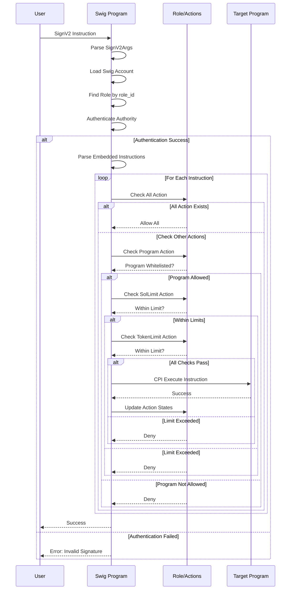
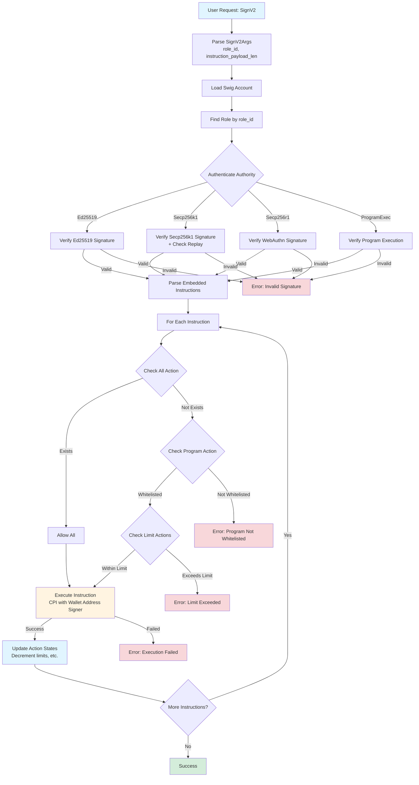
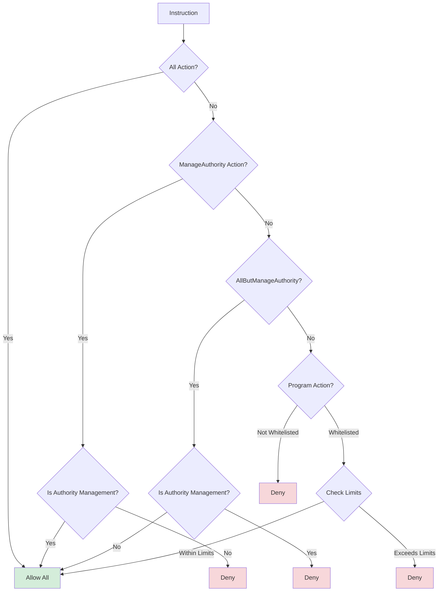
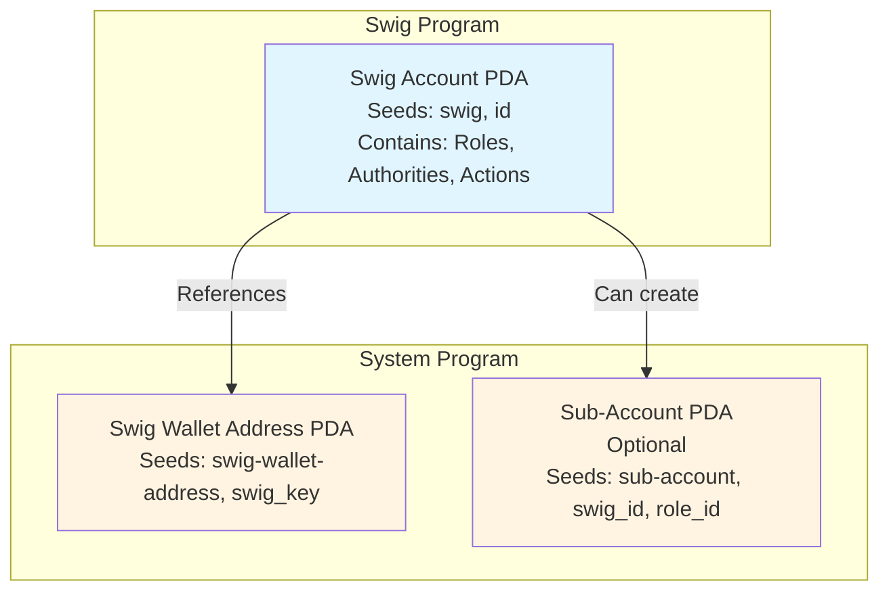
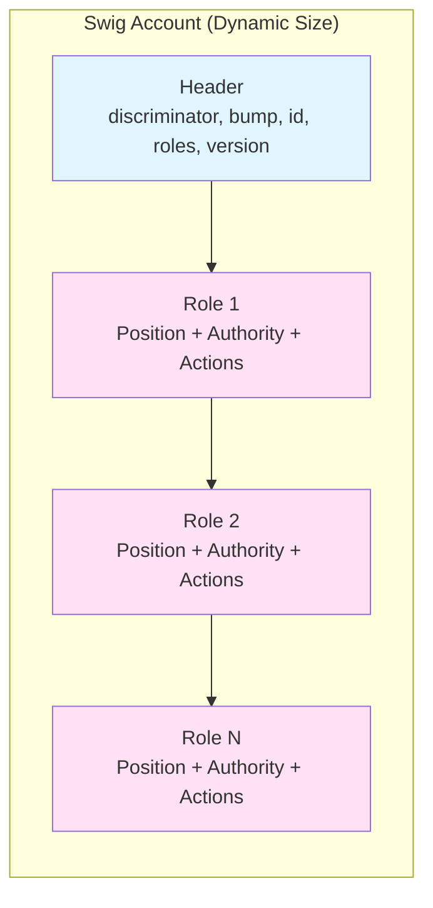
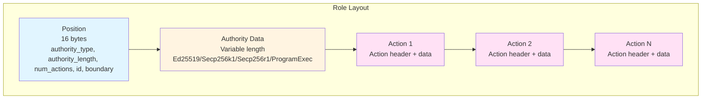

# Swig Wallet Architecture

## Overview

Swig is a smart wallet using the Pinocchio framework with role-based access control (RBAC). All authorities and permissions are stored inline in a single account to reduce rent costs.

---

## 1. PDA Structure (Program Derived Addresses)

### 1.1. Swig Account PDA

**Seeds:**
```rust
seeds = [
    b"swig",
    id.as_ref()  // 32-byte wallet ID
]
```

**Structure:**
```rust
pub struct Swig {
    pub discriminator: u8,      // Account type discriminator
    pub bump: u8,               // PDA bump seed
    pub id: [u8; 32],           // Unique wallet identifier
    pub roles: u16,             // Number of roles
    pub version: u8,            // Account version
    pub _reserved: [u8; 3],     // Reserved padding
    
    // Dynamic data follows (inline):
    // - Roles (Position + Authority + Actions)
}
```

**PDA Derivation:**
- Each wallet has one unique Swig account
- All roles, authorities, and actions are stored inline in this account

### 1.2. Swig Wallet Address PDA

**Seeds:**
```rust
seeds = [
    b"swig-wallet-address",
    swig_key.as_ref()  // Swig account pubkey
]
```

**Structure:**
- System-owned PDA account
- Used as signer for CPI calls
- Equivalent to "smart wallet" in Lazorkit

### 1.3. Sub-Account PDA (Optional)

**Seeds:**
```rust
seeds = [
    b"sub-account",
    swig_id.as_ref(),
    role_id.as_ref()
]
```

**Structure:**
- System-owned PDA account
- Created for each role to manage separate assets
- Optional feature, not required

---

## 2. Permission Rules (Actions)

### 2.1. Action System

**Action Structure:**
```rust
pub struct Action {
    action_type: u16,    // Permission enum value
    length: u16,         // Length of action data
    boundary: u32,       // Boundary marker for next action
}
```

**Permission Types:**
- `All`: Allow all operations
- `ManageAuthority`: Only allow authority management
- `AllButManageAuthority`: Allow all except authority management
- `Program`: Whitelist specific programs
- `ProgramAll`: Allow all programs
- `ProgramCurated`: Curated program list
- `ProgramScope`: Program-scoped permissions
- `SolLimit`: SOL transfer limit
- `SolRecurringLimit`: Recurring SOL limit
- `SolDestinationLimit`: SOL destination limit
- `SolRecurringDestinationLimit`: Recurring SOL destination limit
- `TokenLimit`: Token transfer limit
- `TokenRecurringLimit`: Recurring token limit
- `TokenDestinationLimit`: Token destination limit
- `TokenRecurringDestinationLimit`: Recurring token destination limit
- `StakeAll`: Allow all stake operations
- `StakeLimit`: Stake limit
- `StakeRecurringLimit`: Recurring stake limit
- `SubAccount`: Sub-account permissions

### 2.2. Role Structure

**Position:**
```rust
pub struct Position {
    pub authority_type: u16,      // AuthorityType enum
    pub authority_length: u16,    // Length of authority data
    pub num_actions: u16,          // Number of actions
    padding: u16,
    pub id: u32,                  // Unique role ID
    pub boundary: u32,             // Boundary marker
}
```

**Role Layout:**
```
[Position] (16 bytes)
[Authority Data] (variable length)
[Action 1] (Action header + data)
[Action 2] (Action header + data)
...
```

**Authority Types:**
- `Ed25519`: Ed25519 public key
- `Secp256k1`: Secp256k1 public key
- `Secp256r1`: Secp256r1 public key (Passkey)
- `ProgramExec`: Program execution authority
- Session variants: `Ed25519Session`, `Secp256k1Session`, etc.

### 2.3. Permission Check Flow

**Action Matching:**
```rust
// Get action by type
role.get_action::<All>(&[])?;
role.get_action::<Program>(program_id.as_ref())?;
role.get_action::<SolLimit>(&[])?;
```

**Action Execution:**
- Each action type has its own `check()` method
- Actions are checked in order within the role
- If no action matches → deny
- If action matches → allow (with conditions)

---

## 3. Execute Flow (SignV2)

### 3.1. SignV2 Instruction Flow



### 3.2. SignV2 Instruction Flow (Detailed)

**Step 1: Parse Arguments**
```rust
pub struct SignV2Args {
    instruction: SwigInstruction,  // SignV2 = 1
    instruction_payload_len: u16,
    role_id: u32,                   // Role ID to use
}
```

**Step 2: Load Swig Account**
```rust
let swig = Swig::load_unchecked(swig_account_data)?;
```

**Step 3: Find Role by ID**
```rust
let role = swig.get_role(swig_account_data, args.role_id)?;
```

**Step 4: Authenticate Authority**
```rust
// Parse authority payload
let authority_payload = &instruction_data[SignV2Args::LEN..SignV2Args::LEN + args.instruction_payload_len];

// Authenticate based on authority type
match role.authority.authority_type() {
    AuthorityType::Ed25519 => {
        // Verify Ed25519 signature
        verify_ed25519_signature(...)?;
    },
    AuthorityType::Secp256k1 => {
        // Verify Secp256k1 signature
        verify_secp256k1_signature(...)?;
    },
    // ... other types
}
```

**Step 5: Parse Embedded Instructions**
```rust
let ix_iter = InstructionIterator::new(
    accounts,
    instruction_payload,
    wallet_address_info.key(),
    rkeys,
)?;
```

**Step 6: Check Permissions for Each Instruction**
```rust
for instruction in ix_iter {
    // Check each action type
    if let Some(all_action) = role.get_action::<All>(&[])? {
        // All action allows everything
        continue;
    }
    
    // Check program whitelist
    if let Some(program_action) = role.get_action::<Program>(instruction.program_id.as_ref())? {
        // Program is whitelisted
    } else {
        return Err(ProgramError::InvalidProgramId);
    }
    
    // Check SOL limits
    if let Some(sol_limit) = role.get_action::<SolLimit>(&[])? {
        sol_limit.check(...)?;
    }
    
    // Check token limits
    if let Some(token_limit) = role.get_action::<TokenLimit>(&[])? {
        token_limit.check(...)?;
    }
    
    // ... other action checks
}
```

**Step 7: Execute Instructions**
```rust
// Prepare wallet address signer seeds
let wallet_address_seeds = swig_wallet_address_signer(
    swig_account_info.key().as_ref(),
    &[swig.wallet_address_bump],
);

// Execute each instruction
for instruction in instructions {
    invoke_signed_dynamic(
        &instruction,
        instruction_accounts,
        &[wallet_address_seeds.as_ref()],
    )?;
}
```

**Step 8: Update Action States**
```rust
// After successful execution, update action states
if let Some(sol_limit) = role.get_action::<SolLimit>(&[])? {
    sol_limit.update_state(...)?;
}

if let Some(token_limit) = role.get_action::<TokenLimit>(&[])? {
    token_limit.update_state(...)?;
}
```

### 3.2. Execute Flow Diagram



### 3.3. Action Check Flow Detail



### 3.4. Detailed Execute Flow

```
1. User Request (SignV2)
   ↓
2. Parse SignV2Args (role_id, instruction_payload_len)
   ↓
3. Load Swig Account
   ↓
4. Find Role by role_id
   ↓
5. Authenticate Authority
   ├─ Ed25519: Verify signature
   ├─ Secp256k1: Verify signature + check replay
   ├─ Secp256r1: Verify WebAuthn signature
   └─ ProgramExec: Verify program execution
   ↓
6. Parse Embedded Instructions
   ↓
7. For Each Instruction:
   ├─ Check All action → Allow all?
   ├─ Check Program action → Program whitelisted?
   ├─ Check SolLimit action → Within limit?
   ├─ Check TokenLimit action → Within limit?
   ├─ Check other actions...
   └─ If any check fails → Deny
   ↓
8. Execute Instructions (CPI with wallet address signer)
   ↓
9. Update Action States (decrement limits, etc.)
   ↓
10. Success
```

### 3.3. Action Check Priority

**Check Order:**
1. `All` action → If exists, allow everything
2. `AllButManageAuthority` → Check if authority management
3. `ManageAuthority` → Only allow authority management
4. `Program` actions → Check program whitelist
5. Limit actions → Check limits (SolLimit, TokenLimit, etc.)
6. Destination limit actions → Check destination limits
7. Recurring limit actions → Check recurring limits

**Action Matching:**
- Actions are matched by type and match_data
- Repeatable actions (e.g., `TokenDestinationLimit`) can have multiple instances
- Non-repeatable actions have only 1 instance

---

## 4. Account Relationships

### 4.1. PDA Relationship Diagram



### 4.2. Swig Account Internal Structure



### 4.3. Role Structure Detail



### 4.4. Account Structure

```
Swig Account (PDA)
├─ Owned by: Swig Program
├─ Seeds: [b"swig", id]
├─ Contains: All roles, authorities, actions (inline)
└─ Size: Dynamic (grows with roles/actions)

Swig Wallet Address (PDA)
├─ Owned by: System Program
├─ Seeds: [b"swig-wallet-address", swig_key]
└─ Used as: Signer for CPI calls

Sub-Account (PDA, Optional)
├─ Owned by: System Program
├─ Seeds: [b"sub-account", swig_id, role_id]
└─ Used as: Asset management for specific role
```

---

## 5. Key Features

1. **Single Account Design**: All data in one account → reduces rent cost
2. **Inline Actions**: Permissions stored inline in account
3. **Role-Based**: Each role has its own authorities and actions
4. **Flexible Actions**: Many action types (limits, whitelists, etc.)
5. **Dynamic Sizing**: Account automatically resizes when adding/removing roles/actions
6. **Multiple Authority Types**: Supports Ed25519, Secp256k1, Secp256r1, ProgramExec
7. **Session Support**: Session-based authorities with expiration

---

## 6. Action Examples

### 6.1. All Action
```rust
// Allows all operations
let all_action = All::new();
// No check needed, always allows
```

### 6.2. Program Whitelist
```rust
// Only allow specific programs
let program_action = Program::new(program_id);
// Check: instruction.program_id == program_id
```

### 6.3. SOL Limit
```rust
// Limit SOL transfers
let sol_limit = SolLimit::new(max_amount, remaining_amount);
// Check: transfer_amount <= remaining_amount
// Update: remaining_amount -= transfer_amount
```

### 6.4. Token Limit
```rust
// Limit token transfers per mint
let token_limit = TokenLimit::new(mint, max_amount, remaining_amount);
// Check: transfer_amount <= remaining_amount (for this mint)
// Update: remaining_amount -= transfer_amount
```
